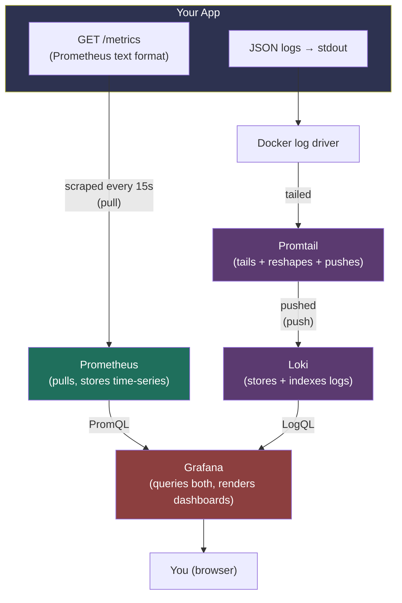
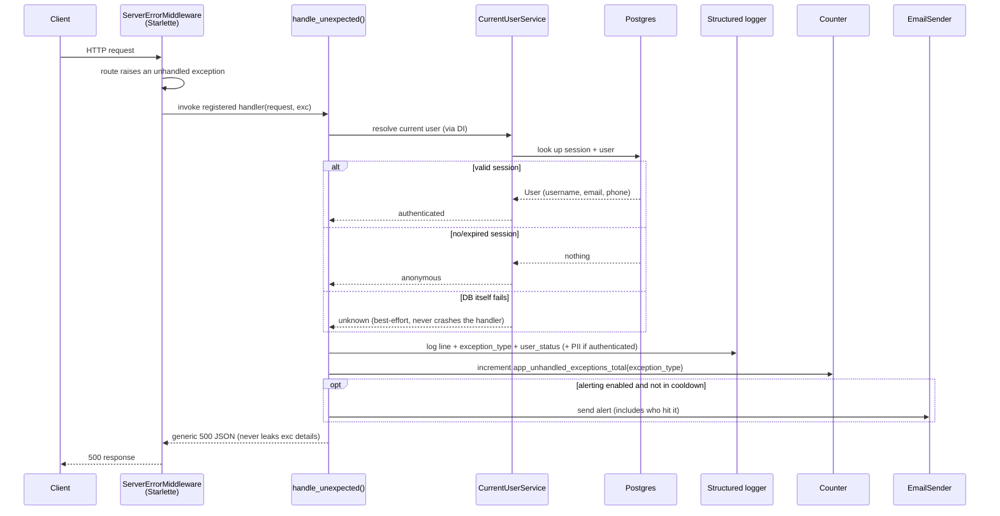
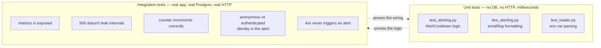

# Observability Implementation Plan

> **Note on the name:** this is written as a "plan," but it documents work that's already shipped — it doubles as the design rationale and as a guide to the actual code. Every file path below is a clickable relative link; open this file's **Preview** in VS Code (`Ctrl+Shift+V` / `Cmd+Shift+V`) and the links will jump straight to the real file.

## Contents

1. [What problem this solves](#1-what-problem-this-solves)
2. [Architecture: how the pieces fit together](#2-architecture-how-the-pieces-fit-together)
3. [Request lifecycle: what happens when something breaks](#3-request-lifecycle-what-happens-when-something-breaks)
4. [Code walkthrough](#4-code-walkthrough)
5. [Docker & config files](#5-docker--config-files)
6. [Test strategy](#6-test-strategy)
7. [DDD, TDD, and Clean Architecture — where they applied, and where they honestly didn't](#7-ddd-tdd-and-clean-architecture--where-they-applied-and-where-they-honestly-didnt)
8. [Free/local vs. paid/cloud — what you'd get from a vendor instead](#8-freelocal-vs-paidcloud--what-youd-get-from-a-vendor-instead)

---

## 1. What problem this solves

Before this feature, the app had no way to answer three questions:

- **"Is the app healthy right now?"** — no request counts, no latency numbers, no error rates.
- **"What just broke, and can I search/filter the logs?"** — logs went to stdout as human-readable text, with no way to query them by field.
- **"Something broke — did anyone notice?"** — nobody finds out about a production bug until a user reports it.

This feature adds three free, open-source, fully local tools to answer them: **Prometheus** (metrics), **Loki** (logs), and **Grafana** (the dashboard that queries both) — plus a critical-error email alert that fires on genuine server bugs (never on ordinary user-input mistakes), and now shows *who* hit the bug.

## 2. Architecture: how the pieces fit together

Two fundamentally different mechanisms are running side by side here — that distinction matters more than any individual tool's configuration.



**Metrics are pull-based.** [`src/app/main/setup.py`](./src/app/main/setup.py) exposes `GET /metrics` — a plain-text snapshot of counters/histograms at that instant. The app never sends anything anywhere; **Prometheus** initiates the connection on its own clock (every 15 seconds, per [`observability/prometheus/prometheus.yml`](./observability/prometheus/prometheus.yml)) and stores what it reads in its own time-series database. If Prometheus is down, the app doesn't know or care.

**Logs are push-based.** The app just writes JSON lines to stdout — it has no idea Loki exists. Docker captures stdout into its own log files. **Promtail** is a separate agent that tails those files, reshapes each line, and actively pushes them to **Loki**'s HTTP push endpoint.

**Grafana stores nothing.** It's a pure query/render layer on top of both — PromQL against Prometheus, LogQL against Loki — which is why one dashboard can show a metrics graph and a live-logs panel side by side even though Prometheus and Loki never talk to each other.

## 3. Request lifecycle: what happens when something breaks

This is the actual sequence of events for one failed request, including the newest piece: identifying *who* made it.



The two things worth noticing: identity resolution is **best-effort** (wrapped so a broken DB session can never crash the error handler itself — see [§4.3](#43-identity-resolution--the-newest-piece)), and the client only ever receives a generic 500 — nothing about the exception type, message, or the user leaks into the HTTP response. All of that detail goes to the log and the alert email only.

## 4. Code walkthrough

### 4.1 Settings & config

[`src/app/main/config/settings.py`](./src/app/main/config/settings.py) defines two new pieces of configuration:

```python
class AppSettings(BaseModel):
    ...
    LOG_FORMAT: Literal["human", "json"] = "human"


class AlertSettings(BaseModel):
    """Controls email alerts fired for unhandled (5xx-class) server errors.

    Deliberately separate from EmailSettings: alerts go to operators/devs about
    the *system*, not to end users about their *account*, so they get their own
    toggle, recipient, and rate limit rather than piggybacking on transactional
    email config.
    """
    ENABLED: bool = False
    TO_EMAIL: str = ""
    TO_NAME: str = "On-call"
    COOLDOWN_S: float = 300.0
```

`AlertSettings` being a *separate* class from the existing `EmailSettings` is a deliberate modeling choice, not incidental — see [§7](#7-ddd-tdd-and-clean-architecture--where-they-applied-and-where-they-honestly-didnt).

[`src/app/main/config/loader.py`](./src/app/main/config/loader.py) reads `AlertSettings` from environment variables prefixed `ALERT_`, exactly like every other settings group in this codebase:

```python
class AlertEnvConfig(BaseSettings, AlertSettings):
    model_config = _DEFAULT_CONFIG_DICT | SettingsConfigDict(env_prefix="ALERT_")


def load_alert_settings() -> AlertSettings:
    return _load_settings(AlertEnvConfig)
```

[`src/app/main/config/logging_.py`](./src/app/main/config/logging_.py) adds `JsonFormatter` alongside the existing `HumanReadableFormatter`:

```python
class JsonFormatter(logging.Formatter):
    """
    One JSON object per line, so a log shipper (e.g. Promtail) can parse and
    index fields for filtering/search — by level, logger name, exception type,
    request path, etc. — instead of grepping free-text.
    """
    def format(self, record: logging.LogRecord) -> str:
        payload: dict[str, Any] = {
            "timestamp": self.formatTime(record, DATEFMT),
            "level": record.levelname,
            "logger": record.name,
            "message": record.getMessage(),
            "module": record.module,
            "line": record.lineno,
            "thread": record.threadName,
        }
        if record.exc_info:
            payload["exception"] = self.formatException(record.exc_info)
        extra = {k: v for k, v in record.__dict__.items() if k not in _STANDARD_RECORD_ATTRS}
        payload.update(extra)
        return json.dumps(payload, default=str)
```

The last four lines are the important part: anything passed via `extra={...}` on a logging call — `exception_type`, `path`, `user_status`, `username`, and so on — automatically becomes its own field in the JSON output, without this formatter needing to know those field names in advance.

### 4.2 Metrics

[`src/app/main/setup.py`](./src/app/main/setup.py) wires up the `/metrics` endpoint using a third-party library rather than a hand-written route:

```python
def setup_metrics(app: FastAPI, *, service_name: str) -> None:
    Instrumentator().instrument(app, metric_namespace=service_name.replace("-", "_")).expose(
        app,
        endpoint="/metrics",
        include_in_schema=False,
    )
```

`Instrumentator.expose()` calls `app.add_route()` internally — that's why there's no matching file under [`src/app/inbound/http/`](./src/app/inbound/http/): it deliberately bypasses this repo's own router composition, because a metrics endpoint is infrastructure plumbing, not a business route.

Alongside it, one hand-written metric:

```python
UNHANDLED_EXCEPTIONS_TOTAL = Counter(
    "app_unhandled_exceptions_total",
    "Total unhandled exceptions that reached the global exception handler.",
    ["exception_type"],
)
```

This is a **module-level singleton** — created once when Python imports the module, alive for the whole process. Every `.labels(exception_type=...).inc()` call anywhere increments the same object. That's exactly the behavior you want in production (one true cumulative count for the whole app); it's also why the tests need before/after deltas rather than absolute values (see [§6](#6-test-strategy)).

### 4.3 Identity resolution — the newest piece

[`src/app/inbound/http/errors/alerting.py`](./src/app/inbound/http/errors/alerting.py) defines the *shape* of what we know about a request's user, and the pure logic for formatting it — no I/O, no database:

```python
@dataclass(frozen=True)
class RequestUserContext:
    """
    Deliberately three states, not just "user or None": "anonymous" (no valid
    session - expected, not a problem) and "unknown" (we tried to resolve the
    session and couldn't - e.g. the DB is down, which for a 500 investigation
    is itself useful information) are different facts and shouldn't collapse
    into the same "no user" bucket.
    """
    status: Literal["authenticated", "anonymous", "unknown"]
    user_id: str | None = None
    username: str | None = None
    email: str | None = None
    phone_number: str | None = None

    def as_log_fields(self) -> dict[str, str]:
        fields: dict[str, str] = {"user_status": self.status}
        if self.user_id is not None:
            fields["user_id"] = self.user_id
        if self.username is not None:
            fields["username"] = self.username
        if self.email is not None:
            fields["user_email"] = self.email
        if self.phone_number is not None:
            fields["user_phone_number"] = self.phone_number
        return fields
```

The **actual resolution** — the part that talks to the database — lives in [`src/app/main/setup.py`](./src/app/main/setup.py), deliberately kept separate from the pure formatting logic above:

```python
async def _try_get_request_user_context(request: Request) -> RequestUserContext:
    """
    Best-effort: resolving identity must never crash error handling itself.
    If the original failure already broke the request's DB session, or the
    DB itself is down, this degrades to "unknown" rather than blocking the
    500 response or masking the real error with a new one.
    """
    try:
        current_user_service = await request.state.dishka_container.get(CurrentUserService)
        user = await current_user_service.get_current_user()
    except (AuthenticationError, AuthorizationError):
        # AuthenticationError: no session at all (no cookie, unknown session, expired).
        # AuthorizationError: session was valid, but the user behind it has since
        # been deleted/deactivated. Both mean "no usable identity for this request".
        return RequestUserContext(status="anonymous")
    except Exception:
        logger.debug("Could not resolve current user for error context", exc_info=True)
        return RequestUserContext(status="unknown")

    return RequestUserContext(
        status="authenticated",
        user_id=str(user.id_),
        username=user.username.value,
        email=user.email.value,
        phone_number=user.phone_number.value,
    )
```

**Why this only runs on the error path, not every request:** your session cookie doesn't contain a username or even a user ID — only a session ID (see [`src/app/outbound/auth_ctx/service.py`](./src/app/outbound/auth_ctx/service.py)). Resolving a human-readable identity always costs at least one database round-trip (the session table), and the full profile costs a second (the users table). Running that on every single request just for observability would add real, system-wide latency and DB load for a nice-to-have. Restricting it to the error/alert path means the cost is paid only when something has already gone wrong — which is also when you actually need the answer.

**Why it's wrapped in `try/except` at every step:** if the exception being handled *is* a database problem, trying to resolve identity by querying the database again could itself fail. This function is designed to degrade to `"unknown"` rather than ever raising — the golden rule for anything hanging off an error handler is that it must never become a second source of failure.

The exception handler itself, tying it together as a pure ASGI middleware:

```python
class GlobalExceptionMiddleware:
    def __init__(
        self,
        app: ASGIApp,
        *,
        alert_enabled: bool,
        alert_to_email: str,
        alert_to_name: str,
        alert_cooldown: AlertCooldown,
    ) -> None:
        self.app = app
        self._alert_enabled = alert_enabled
        self._alert_to_email = alert_to_email
        self._alert_to_name = alert_to_name
        self._alert_cooldown = alert_cooldown

    async def __call__(self, scope: Scope, receive: Receive, send: Send) -> None:
        if scope["type"] != "http":
            await self.app(scope, receive, send)
            return

        try:
            await self.app(scope, receive, send)
        except Exception as exc:
            request = Request(scope)
            await self._handle(request, exc)
            response = JSONResponse(
                status_code=status.HTTP_500_INTERNAL_SERVER_ERROR,
                content=internal_server_error(exc),
            )
            await response(scope, receive, send)
```

**A privacy note, deliberately:** email and phone number only ever appear in logs/alerts for the request that actually errored — never on routine successful requests. They still land in Loki (7-day retention, see [`observability/loki/loki-config.yml`](./observability/loki/loki-config.yml)), which is worth being deliberate about given POPIA. If you'd rather never see raw email/phone in logs at all, `_describe_user()` in [`alerting.py`](./src/app/inbound/http/errors/alerting.py) is the one place to redact them down to just `user_id`/`username`.

### 4.4 Rate-limited alerting

Also in [`alerting.py`](./src/app/inbound/http/errors/alerting.py):

```python
@dataclass
class AlertCooldown:
    cooldown_s: float
    clock: Callable[[], float] = field(default=time.monotonic)
    _last_sent_at: dict[str, float] = field(default_factory=dict, init=False)

    def should_send(self, exception_type: str) -> bool:
        now = self.clock()
        last_sent = self._last_sent_at.get(exception_type)
        if last_sent is not None and (now - last_sent) < self.cooldown_s:
            return False
        self._last_sent_at[exception_type] = now
        return True
```

Note the `clock` parameter — it accepts *any* zero-arg callable returning a float, not just `time.monotonic`. That's what lets the tests simulate the passage of time instantly instead of calling `time.sleep()` (see [§6](#6-test-strategy)).

[`src/app/main/run.py`](./src/app/main/run.py) is the composition root — the one place that knows about every piece and wires it together, once, at startup:

```python
alert_settings = load_alert_settings()
...
container = make_async_container(
    ...,
    context={
        ...
        AlertSettings: alert_settings,
    },
)
setup_dishka(container, app)
setup_middlewares(app, cookie_settings)
setup_metrics(app, service_name=app_settings.SERVICE_NAME)
setup_global_exception_handlers(app, alert_settings=alert_settings)
```

Within [`setup.py`](./src/app/main/setup.py), `setup_global_exception_handlers` adds the `GlobalExceptionMiddleware` to the stack, keeping the actual middleware implementation completely decoupled from the main settings by unpacking its properties at invocation time:

```python
def setup_global_exception_handlers(app: FastAPI, *, alert_settings: AlertSettings) -> None:
    alert_cooldown = AlertCooldown(cooldown_s=alert_settings.COOLDOWN_S)
    app.add_middleware(
        GlobalExceptionMiddleware,
        alert_enabled=alert_settings.ENABLED,
        alert_to_email=alert_settings.TO_EMAIL,
        alert_to_name=alert_settings.TO_NAME,
        alert_cooldown=alert_cooldown,
    )
```

## 5. Docker & config files

[`docker-compose.yml`](./docker-compose.yml) adds four new services alongside your existing `app` and `db_pg`:

| Service | Image | What it's told to do |
|---|---|---|
| `prometheus` | `prom/prometheus:v3.13.2` | Scrape `app:8000/metrics` every 15s — [`observability/prometheus/prometheus.yml`](./observability/prometheus/prometheus.yml) |
| `grafana` | `grafana/grafana:13.0.0` | Auto-load the Prometheus + Loki datasources and starter dashboard — [`observability/grafana/provisioning/`](./observability/grafana/provisioning/) |
| `loki` | `grafana/loki:3.7.0` | Store logs on disk, 7-day retention — [`observability/loki/loki-config.yml`](./observability/loki/loki-config.yml) |
| `promtail` | `grafana/promtail:3.6.8` | Discover every container via the Docker socket, ship their logs to Loki — [`observability/promtail/promtail-config.yml`](./observability/promtail/promtail-config.yml) |

The most interesting of these is [`promtail-config.yml`](./observability/promtail/promtail-config.yml):

```yaml
pipeline_stages:
  - docker: {}        # unwraps Docker's own {"log": "...", "stream": "..."} envelope
  - json:
      expressions:
        level: level   # pulls just `level` out of the app's own JSON log line
  - labels:
      level:            # promotes only `level` to a Loki label
```

`level` is the *only* field promoted to a label deliberately — it only has 5 possible values (`DEBUG`/`INFO`/`WARNING`/`ERROR`/`CRITICAL`). `exception_type`, `path`, `username`, etc. stay inside the log line itself and get filtered at query time instead, e.g. `{compose_service="app"} | json | exception_type="ValueError"` in Grafana Explore. This is Loki's own guidance, not specific to this app: promoting high-cardinality fields to labels blows up its index.

[`observability/grafana/provisioning/dashboards/app-overview.json`](./observability/grafana/provisioning/dashboards/app-overview.json) ships a pre-built dashboard with four panels — request rate by endpoint, 5xx error rate, p50/p95/p99 latency, and unhandled exceptions by type — plus a live-logs panel, so Grafana looks useful the first time you open it rather than being an empty canvas.

## 6. Test strategy

Two layers, each catching a different class of mistake:



[`tests/unit/inbound/http/errors/test_alerting.py`](./tests/unit/inbound/http/errors/test_alerting.py) tests `AlertCooldown` and `build_error_alert_email` completely in isolation:

```python
class _FakeClock:
    """Deterministic, manually-advanced stand-in for time.monotonic."""
    def __init__(self, start: float = 0.0) -> None:
        self._now = start
    def __call__(self) -> float:
        return self._now
    def advance(self, seconds: float) -> None:
        self._now += seconds


def test_cooldown_suppresses_repeat_alert_within_window() -> None:
    clock = _FakeClock()
    sut = AlertCooldown(cooldown_s=60.0, clock=clock)
    assert sut.should_send("ValueError") is True
    clock.advance(30.0)
    assert sut.should_send("ValueError") is False
```

[`tests/integration/with_infra/observability/test_metrics_and_alerting.py`](./tests/integration/with_infra/observability/test_metrics_and_alerting.py) tests the *wiring* — a real HTTP request through a real `FastAPI` app, a real DI container, a real Postgres, using `SpyEmailSender` instead of a mock so assertions check what actually happened:

```python
async def test_unhandled_exception_from_a_logged_in_user_shows_their_identity_in_the_alert(
    it_client: httpx2.AsyncClient,
    it_spy_email_sender: SpyEmailSender,
) -> None:
    username, password = create_raw_username(), create_raw_password()
    email, phone_number = create_raw_email(), create_raw_phone_number()
    await it_client.post(SIGN_UP_ENDPOINT, json={
        "username": username, "email": email, "phone_number": phone_number, "password": password,
    })
    await authenticate(it_client, username, password)

    await it_client.get(UNHANDLED_ERROR_ENDPOINT)

    alert_emails = [s for s in it_spy_email_sender.sent if s["to_email"] == "oncall@example.com"]
    assert len(alert_emails) == 1
    assert username in alert_emails[0]["html_body"]
    assert email in alert_emails[0]["html_body"]
    assert phone_number in alert_emails[0]["html_body"]
```

Two real bugs surfaced only at this layer, worth knowing about since they're general lessons, not one-offs:

1. **`prometheus_client.Counter` is a process-wide singleton.** Two tests in the same pytest run share the same counts, so absolute-value assertions (`assert count == 1`) are flaky depending on run order. Fixed by asserting on the *delta* (before/after), which is what real production monitoring wants anyway — one cumulative count for the process's lifetime.
2. **We solved the duplicate logging and traceback problem** by utilizing a pure ASGI middleware `GlobalExceptionMiddleware` registered above `AuthCookieMiddleware` (instead of `@app.exception_handler(Exception)`). When using standard `BaseHTTPMiddleware`, Starlette's `call_next` would re-raise exceptions even after the router-level handler responded, causing Uvicorn to double-log them. The ASGI middleware catches exceptions cleanly, meaning `httpx2.ASGITransport` tests no longer require `raise_app_exceptions=False` to exercise 500 response behavior.

## 7. DDD, TDD, and Clean Architecture — where they applied, and where they honestly didn't

**Clean Architecture — genuinely central.** Almost none of this lives in [`src/app/core/`](./src/app/core/) (the domain/business layer) — it's all in [`src/app/main/`](./src/app/main/) (composition root) and [`src/app/inbound/http/errors/`](./src/app/inbound/http/errors/) (an HTTP-adapter concern), because metrics/logging/alerting aren't business knowledge, they're facts about how *this deployment* observes itself. The one deliberate dependency-inversion decision: `_try_send_alert_email` depends on [`EmailSender`](./src/app/core/common/ports/email_sender.py) — an abstraction *defined in* `core`, not on `smtplib` directly — so the outer layer doesn't know or care whether the real implementation is SMTP or the console stub used in tests. No equivalent port exists for the Prometheus counter, deliberately: nothing in `core/` ever needs to record a metric, only the outermost exception handler does, so wrapping it in a port would add indirection with nobody on the other end needing the decoupling.

**DDD — mostly not applicable, and that's correct, not a gap.** There's no `Alert` entity, no `MetricEvent` value object, because none of this is genuine business/domain knowledge worth modeling that carefully. The one place DDD-style precision showed up: [`AlertSettings`](./src/app/main/config/settings.py) is a distinct class from `EmailSettings`, even though today they're mechanically almost identical. They're conceptually different — "how the system talks to its operators" vs. "how the business talks to its customers" — and collapsing them would have been a modeling mistake even though it'd have been less code today.

**TDD — precisely, not strict red-green-refactor narrated turn by turn, but the real discipline held.** [`alerting.py`](./src/app/inbound/http/errors/alerting.py) was written, [`test_alerting.py`](./tests/unit/inbound/http/errors/test_alerting.py) was written against it and run to green, *before* either was wired into [`setup.py`](./src/app/main/setup.py). The two real bugs in [§6](#6-test-strategy) are the actual payoff of that discipline: neither was a logic bug the unit tests could have caught — both were *wiring* bugs, which is exactly why the integration layer exists as a second, distinct net.

## 8. Free/local vs. paid/cloud — what you'd get from a vendor instead

| | This stack (self-hosted, free) | Grafana Cloud (free tier) | Sentry (free tier) |
|---|---|---|---|
| Metrics + dashboards | Prometheus + Grafana, unlimited, runs on your machine | 10k active series, 50GB logs/traces, 14-day retention, 3 users | Not its focus |
| Logs | Loki, unlimited (bounded by your disk) | Included in the 50GB above | 5GB/month included |
| Error tracking by type | `app_unhandled_exceptions_total` + Grafana panel | Same, via Grafana | Sentry's whole product — auto-groups by stack trace, zero config |
| Alerting | Email via your own SMTP, cooldown-limited | Grafana Alertmanager | Email included, 1 user on free tier |
| Cost as you grow | $0 forever, you own uptime/backups | ~$19/mo once you outgrow the caps | ~$26/mo once you exceed ~5,000 errors/month |

If per-error-type grouping ever matters more than dashboards, [GlitchTip](https://glitchtip.com/) is worth a look — a self-hosted, open-source, Sentry-API-compatible tool that groups errors by type/stack trace natively, using the same `sentry-sdk` Python client. It'd sit alongside this stack rather than replace it (metrics/dashboards and error-grouping are genuinely different jobs).
