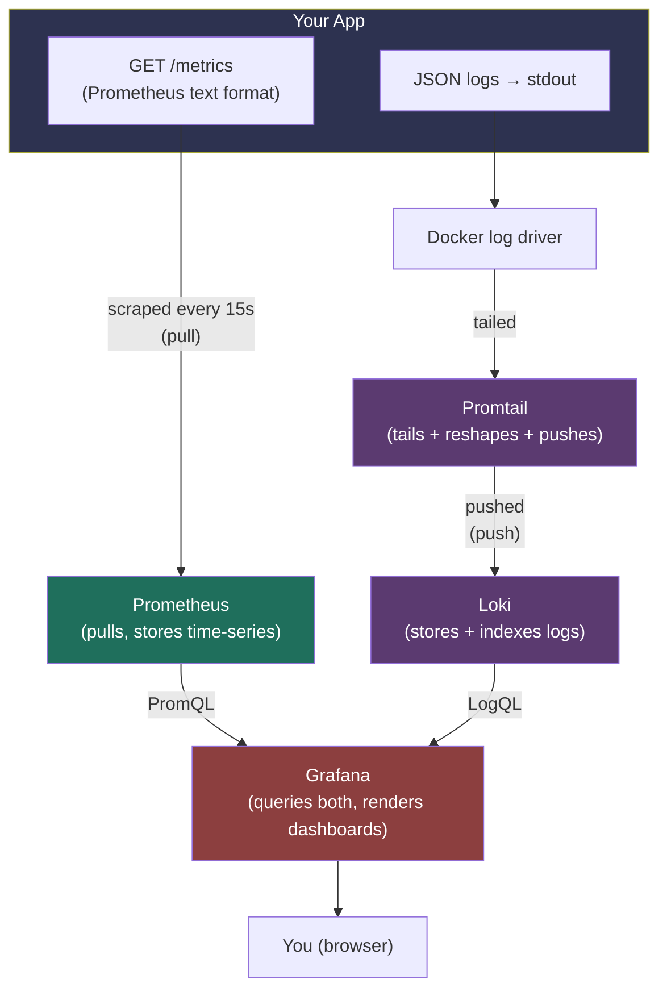
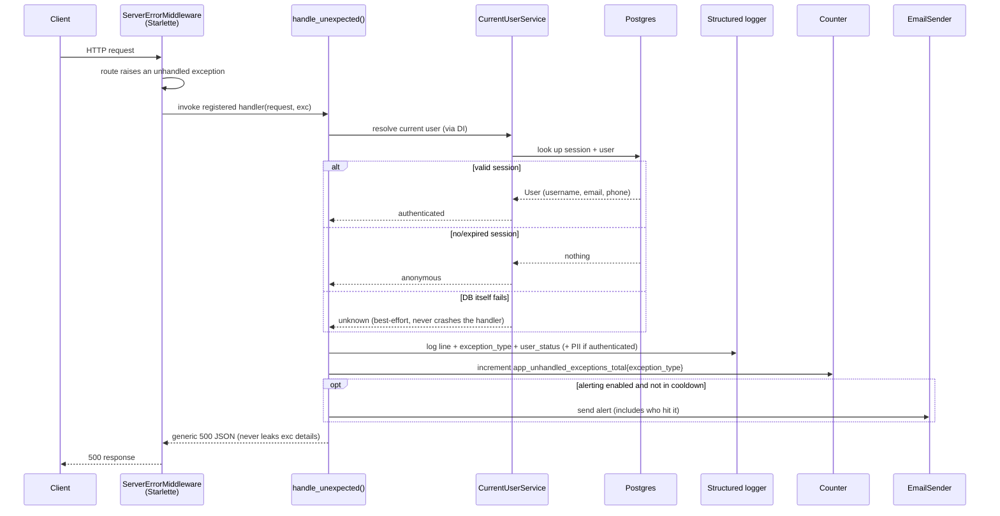
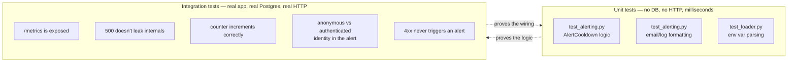

# Observability Implementation Plan

> **Note on the name:** this is written as a "plan," but it documents work that's already shipped — it doubles as the design rationale and as a guide to the actual code. Every file path below is a clickable relative link; open this file's **Preview** in VS Code (`Ctrl+Shift+V` / `Cmd+Shift+V`) and the links will jump straight to the real file.

## Contents

1. [What problem this solves](#1-what-problem-this-solves)
2. [Architecture: how the pieces fit together](#2-architecture-how-the-pieces-fit-together)
3. [Request lifecycle: what happens when something breaks](#3-request-lifecycle-what-happens-when-something-breaks)
4. [Code walkthrough](#4-code-walkthrough)
5. [Docker & config files](#5-docker--config-files)
6. [Test strategy](#6-test-strategy)
7. [DDD, TDD, and Clean Architecture — where they applied, and where they honestly didn't](#7-ddd-tdd-and-clean-architecture--where-they-applied-and-where-they-honestly-didnt)
8. [Free/local vs. paid/cloud — what you'd get from a vendor instead](#8-freelocal-vs-paidcloud--what-youd-get-from-a-vendor-instead)

---

## 1. What problem this solves

Before this feature, the app had no way to answer three questions:

- **"Is the app healthy right now?"** — no request counts, no latency numbers, no error rates.
- **"What just broke, and can I search/filter the logs?"** — logs went to stdout as human-readable text, with no way to query them by field.
- **"Something broke — did anyone notice?"** — nobody finds out about a production bug until a user reports it.

This feature adds three free, open-source, fully local tools to answer them: **Prometheus** (metrics), **Loki** (logs), and **Grafana** (the dashboard that queries both) — plus a critical-error email alert that fires on genuine server bugs (never on ordinary user-input mistakes), and now shows *who* hit the bug.

## User stories

| Story | As a | I want | So that | Acceptance criteria |
|---|---|---|---|---|
| 1. See whether the app is healthy | operator | request rate, latency and error-rate metrics | I can tell at a glance whether the app is healthy | `GET /metrics` returns 200 in Prometheus text format<br>Prometheus scrapes it every 15s<br>Grafana's "App Overview" dashboard shows the panels |
| 2. Search the logs | developer | structured JSON logs I can filter by field in Grafana | I can find what broke without grepping free text | `APP_LOG_FORMAT=json` writes one JSON object per line<br>Loki query `{compose_service="app"} \| json \| exception_type="ValueError"` finds the error |
| 3. Hear about server bugs | on-call developer | an email when a request hits an unhandled 5xx error | I find out before a user reports it | Only when `ALERT_ENABLED=true`<br>Never for 4xx errors<br>At most one email per exception type per `ALERT_COOLDOWN_S`<br>Shows who hit it (user or anonymous) |
| 4. Count unhandled errors | operator | a counter of unhandled exceptions by type | I can graph and spot error spikes | `app_unhandled_exceptions_total{exception_type=...}` goes up by 1 per unhandled error |
| 5. Nothing leaks to the client | API client | a generic 500 body when the server fails | internal details never reach callers | The 500 body never contains the exception message or the user's details |

## 2. Architecture: how the pieces fit together

Two fundamentally different mechanisms are running side by side here — that distinction matters more than any individual tool's configuration.



**Metrics are pull-based.** [`src/app/main/setup.py`](./src/app/main/setup.py) exposes `GET /metrics` — a plain-text snapshot of counters/histograms at that instant. The app never sends anything anywhere; **Prometheus** initiates the connection on its own clock (every 15 seconds, per [`observability/prometheus/prometheus.yml`](./observability/prometheus/prometheus.yml)) and stores what it reads in its own time-series database. If Prometheus is down, the app doesn't know or care.

**Logs are push-based.** The app just writes JSON lines to stdout — it has no idea Loki exists. Docker captures stdout into its own log files. **Promtail** is a separate agent that tails those files, reshapes each line, and actively pushes them to **Loki**'s HTTP push endpoint.

**Grafana stores nothing.** It's a pure query/render layer on top of both — PromQL against Prometheus, LogQL against Loki — which is why one dashboard can show a metrics graph and a live-logs panel side by side even though Prometheus and Loki never talk to each other.

## 3. Request lifecycle: what happens when something breaks

This is the actual sequence of events for one failed request, including the newest piece: identifying *who* made it.



The two things worth noticing: identity resolution is **best-effort** (wrapped so a broken DB session can never crash the error handler itself — see [§4.3](#43-identity-resolution--the-newest-piece)), and the client only ever receives a generic 500 — nothing about the exception type, message, or the user leaks into the HTTP response. All of that detail goes to the log and the alert email only.

## 4. Code walkthrough

### 4.1 Settings & config

[`src/app/main/config/settings.py`](./src/app/main/config/settings.py) defines two new pieces of configuration:

```python
class AppSettings(BaseModel):
    ...
    LOG_FORMAT: Literal["human", "json"] = "human"


class AlertSettings(BaseModel):
    """Controls email alerts fired for unhandled (5xx-class) server errors.

    Deliberately separate from EmailSettings: alerts go to operators/devs about
    the *system*, not to end users about their *account*, so they get their own
    toggle, recipient, and rate limit rather than piggybacking on transactional
    email config.
    """

    ENABLED: bool = False
    TO_EMAIL: str = ""
    TO_NAME: str = "On-call"
    COOLDOWN_S: float = 300.0
```

`AlertSettings` being a *separate* class from the existing `EmailSettings` is a deliberate modeling choice, not incidental — see [§7](#7-ddd-tdd-and-clean-architecture--where-they-applied-and-where-they-honestly-didnt).

[`src/app/main/config/loader.py`](./src/app/main/config/loader.py) reads `AlertSettings` from environment variables prefixed `ALERT_`, exactly like every other settings group in this codebase:

```python
class AlertEnvConfig(BaseSettings, AlertSettings):
    model_config = _DEFAULT_CONFIG_DICT | SettingsConfigDict(env_prefix="ALERT_")


def load_alert_settings() -> AlertSettings:
    return _load_settings(AlertEnvConfig)
```

[`src/app/main/config/logging_.py`](./src/app/main/config/logging_.py) adds `JsonFormatter` alongside the existing `HumanReadableFormatter`:

```python
class JsonFormatter(logging.Formatter):
    """
    One JSON object per line, so a log shipper (e.g. Promtail) can parse and
    index fields for filtering/search — by level, logger name, exception type,
    request path, etc. — instead of grepping free-text.
    """

    def format(self, record: logging.LogRecord) -> str:
        payload: dict[str, Any] = {
            "timestamp": self.formatTime(record, DATEFMT),
            "level": record.levelname,
            "logger": record.name,
            "message": record.getMessage(),
            "module": record.module,
            "line": record.lineno,
            "thread": record.threadName,
        }
        if record.exc_info:
            payload["exception"] = self.formatException(record.exc_info)
        extra = {k: v for k, v in record.__dict__.items() if k not in _STANDARD_RECORD_ATTRS}
        payload.update(extra)
        return json.dumps(payload, default=str)
```

The last four lines are the important part: anything passed via `extra={...}` on a logging call — `exception_type`, `path`, `user_status`, `username`, and so on — automatically becomes its own field in the JSON output, without this formatter needing to know those field names in advance.

### 4.2 Metrics

[`src/app/main/setup.py`](./src/app/main/setup.py) wires up the `/metrics` endpoint using a third-party library rather than a hand-written route:

```python
def setup_metrics(app: FastAPI, *, service_name: str) -> None:
    Instrumentator().instrument(app, metric_namespace=service_name.replace("-", "_")).expose(
        app,
        endpoint="/metrics",
        include_in_schema=False,
    )
```

`Instrumentator.expose()` calls `app.add_route()` internally — that's why there's no matching file under [`src/app/inbound/http/`](./src/app/inbound/http/): it deliberately bypasses this repo's own router composition, because a metrics endpoint is infrastructure plumbing, not a business route.

Alongside it, one hand-written metric:

```python
UNHANDLED_EXCEPTIONS_TOTAL = Counter(
    "app_unhandled_exceptions_total",
    "Total unhandled exceptions that reached the global exception handler.",
    ["exception_type"],
)
```

This is a **module-level singleton** — created once when Python imports the module, alive for the whole process. Every `.labels(exception_type=...).inc()` call anywhere increments the same object. That's exactly the behavior you want in production (one true cumulative count for the whole app); it's also why the tests need before/after deltas rather than absolute values (see [§6](#6-test-strategy)).

### 4.3 Identity resolution — the newest piece

[`src/app/inbound/http/errors/alerting.py`](./src/app/inbound/http/errors/alerting.py) defines the *shape* of what we know about a request's user, and the pure logic for formatting it — no I/O, no database:

```python
@dataclass(frozen=True)
class RequestUserContext:
    """
    Deliberately three states, not just "user or None": "anonymous" (no valid
    session - expected, not a problem) and "unknown" (we tried to resolve the
    session and couldn't - e.g. the DB is down, which for a 500 investigation
    is itself useful information) are different facts and shouldn't collapse
    into the same "no user" bucket.
    """

    status: Literal["authenticated", "anonymous", "unknown"]
    user_id: str | None = None
    username: str | None = None
    email: str | None = None
    phone_number: str | None = None

    def as_log_fields(self) -> dict[str, str]:
        fields: dict[str, str] = {"user_status": self.status}
        if self.user_id is not None:
            fields["user_id"] = self.user_id
        if self.username is not None:
            fields["username"] = self.username
        if self.email is not None:
            fields["user_email"] = self.email
        if self.phone_number is not None:
            fields["user_phone_number"] = self.phone_number
        return fields
```

The **actual resolution** — the part that talks to the database — lives in [`src/app/main/setup.py`](./src/app/main/setup.py), deliberately kept separate from the pure formatting logic above:

```python
async def _try_get_request_user_context(request: Request) -> RequestUserContext:
    """
    Best-effort: resolving identity must never crash error handling itself.
    If the original failure already broke the request's DB session, or the
    DB itself is down, this degrades to "unknown" rather than blocking the
    500 response or masking the real error with a new one.
    """
    try:
        current_user_service = await request.state.dishka_container.get(CurrentUserService)
        user = await current_user_service.get_current_user()
    except (AuthenticationError, AuthorizationError):
        # AuthenticationError: no session at all (no cookie, unknown session, expired).
        # AuthorizationError: session was valid, but the user behind it has since
        # been deleted/deactivated. Both mean "no usable identity for this request".
        return RequestUserContext(status="anonymous")
    except Exception:
        logger.debug("Could not resolve current user for error context", exc_info=True)
        return RequestUserContext(status="unknown")

    return RequestUserContext(
        status="authenticated",
        user_id=str(user.id_),
        username=user.username.value,
        email=user.email.value,
        phone_number=user.phone_number.value,
    )
```

**Why this only runs on the error path, not every request:** your session cookie doesn't contain a username or even a user ID — only a session ID (see [`src/app/outbound/auth_ctx/service.py`](./src/app/outbound/auth_ctx/service.py)). Resolving a human-readable identity always costs at least one database round-trip (the session table), and the full profile costs a second (the users table). Running that on every single request just for observability would add real, system-wide latency and DB load for a nice-to-have. Restricting it to the error/alert path means the cost is paid only when something has already gone wrong — which is also when you actually need the answer.

**Why it's wrapped in `try/except` at every step:** if the exception being handled *is* a database problem, trying to resolve identity by querying the database again could itself fail. This function is designed to degrade to `"unknown"` rather than ever raising — the golden rule for anything hanging off an error handler is that it must never become a second source of failure.

The exception handler itself, tying it together as a pure ASGI middleware:

```python
class GlobalExceptionMiddleware:
    def __init__(
        self,
        app: ASGIApp,
        *,
        alert_enabled: bool,
        alert_to_email: str,
        alert_to_name: str,
        alert_cooldown: AlertCooldown,
    ) -> None:
        self.app = app
        self._alert_enabled = alert_enabled
        self._alert_to_email = alert_to_email
        self._alert_to_name = alert_to_name
        self._alert_cooldown = alert_cooldown

    async def __call__(self, scope: Scope, receive: Receive, send: Send) -> None:
        if scope["type"] != "http":
            await self.app(scope, receive, send)
            return

        try:
            await self.app(scope, receive, send)
        except Exception as exc:
            request = Request(scope)
            await self._handle(request, exc)
            response = JSONResponse(
                status_code=status.HTTP_500_INTERNAL_SERVER_ERROR,
                content=internal_server_error(exc),
            )
            await response(scope, receive, send)
```

**A privacy note, deliberately:** email and phone number only ever appear in logs/alerts for the request that actually errored — never on routine successful requests. They still land in Loki (7-day retention, see [`observability/loki/loki-config.yml`](./observability/loki/loki-config.yml)), which is worth being deliberate about given POPIA. If you'd rather never see raw email/phone in logs at all, `_describe_user()` in [`alerting.py`](./src/app/inbound/http/errors/alerting.py) is the one place to redact them down to just `user_id`/`username`.

### 4.4 Rate-limited alerting

Also in [`alerting.py`](./src/app/inbound/http/errors/alerting.py):

```python
@dataclass
class AlertCooldown:
    cooldown_s: float
    clock: Callable[[], float] = field(default=time.monotonic)
    _last_sent_at: dict[str, float] = field(default_factory=dict, init=False)

    def should_send(self, exception_type: str) -> bool:
        now = self.clock()
        last_sent = self._last_sent_at.get(exception_type)
        if last_sent is not None and (now - last_sent) < self.cooldown_s:
            return False
        self._last_sent_at[exception_type] = now
        return True
```

Note the `clock` parameter — it accepts *any* zero-arg callable returning a float, not just `time.monotonic`. That's what lets the tests simulate the passage of time instantly instead of calling `time.sleep()` (see [§6](#6-test-strategy)).

[`src/app/main/run.py`](./src/app/main/run.py) is the composition root — the one place that knows about every piece and wires it together, once, at startup:

```python
alert_settings = load_alert_settings()
...
container = make_async_container(
    ...,
    context={
        ...
        AlertSettings: alert_settings,
    },
)
setup_dishka(container, app)
setup_middlewares(app, cookie_settings)
setup_metrics(app, service_name=app_settings.SERVICE_NAME)
setup_global_exception_handlers(app, alert_settings=alert_settings)
```

Within [`setup.py`](./src/app/main/setup.py), `setup_global_exception_handlers` adds the `GlobalExceptionMiddleware` to the stack, keeping the actual middleware implementation completely decoupled from the main settings by unpacking its properties at invocation time:

```python
def setup_global_exception_handlers(app: FastAPI, *, alert_settings: AlertSettings) -> None:
    alert_cooldown = AlertCooldown(cooldown_s=alert_settings.COOLDOWN_S)
    app.add_middleware(
        GlobalExceptionMiddleware,
        alert_enabled=alert_settings.ENABLED,
        alert_to_email=alert_settings.TO_EMAIL,
        alert_to_name=alert_settings.TO_NAME,
        alert_cooldown=alert_cooldown,
    )
```

## 5. Docker & config files

[`docker-compose.yml`](./docker-compose.yml) adds four new services alongside your existing `app` and `db_pg`:

| Service | Image | What it's told to do |
|---|---|---|
| `prometheus` | `prom/prometheus:v3.13.2` | Scrape `app:8000/metrics` every 15s — [`observability/prometheus/prometheus.yml`](./observability/prometheus/prometheus.yml) |
| `grafana` | `grafana/grafana:13.0.0` | Auto-load the Prometheus + Loki datasources and starter dashboard — [`observability/grafana/provisioning/`](./observability/grafana/provisioning/) |
| `loki` | `grafana/loki:3.7.0` | Store logs on disk, 7-day retention — [`observability/loki/loki-config.yml`](./observability/loki/loki-config.yml) |
| `promtail` | `grafana/promtail:3.6.8` | Discover every container via the Docker socket, ship their logs to Loki — [`observability/promtail/promtail-config.yml`](./observability/promtail/promtail-config.yml) |

The most interesting of these is [`promtail-config.yml`](./observability/promtail/promtail-config.yml):

```yaml
pipeline_stages:
  - docker: {}        # unwraps Docker's own {"log": "...", "stream": "..."} envelope
  - json:
      expressions:
        level: level   # pulls just `level` out of the app's own JSON log line
  - labels:
      level:            # promotes only `level` to a Loki label
```

`level` is the *only* field promoted to a label deliberately — it only has 5 possible values (`DEBUG`/`INFO`/`WARNING`/`ERROR`/`CRITICAL`). `exception_type`, `path`, `username`, etc. stay inside the log line itself and get filtered at query time instead, e.g. `{compose_service="app"} | json | exception_type="ValueError"` in Grafana Explore. This is Loki's own guidance, not specific to this app: promoting high-cardinality fields to labels blows up its index.

[`observability/grafana/provisioning/dashboards/app-overview.json`](./observability/grafana/provisioning/dashboards/app-overview.json) ships a pre-built dashboard with four panels — request rate by endpoint, 5xx error rate, p50/p95/p99 latency, and unhandled exceptions by type — plus a live-logs panel, so Grafana looks useful the first time you open it rather than being an empty canvas.

## 6. Test strategy

Two layers, each catching a different class of mistake:



[`tests/unit/inbound/http/errors/test_alerting.py`](./tests/unit/inbound/http/errors/test_alerting.py) tests `AlertCooldown` and `build_error_alert_email` completely in isolation:

```python
class _FakeClock:
    """Deterministic, manually-advanced stand-in for time.monotonic."""

    def __init__(self, start: float = 0.0) -> None:
        self._now = start

    def __call__(self) -> float:
        return self._now

    def advance(self, seconds: float) -> None:
        self._now += seconds


def test_cooldown_suppresses_repeat_alert_within_window() -> None:
    clock = _FakeClock()
    sut = AlertCooldown(cooldown_s=60.0, clock=clock)
    assert sut.should_send("ValueError") is True
    clock.advance(30.0)
    assert sut.should_send("ValueError") is False
```

[`tests/integration/with_infra/observability/test_metrics_and_alerting.py`](./tests/integration/with_infra/observability/test_metrics_and_alerting.py) tests the *wiring* — a real HTTP request through a real `FastAPI` app, a real DI container, a real Postgres, using `SpyEmailSender` instead of a mock so assertions check what actually happened:

```python
async def test_unhandled_exception_from_a_logged_in_user_shows_their_identity_in_the_alert(
    it_client: httpx2.AsyncClient,
    it_spy_email_sender: SpyEmailSender,
) -> None:
    username, password = create_raw_username(), create_raw_password()
    email, phone_number = create_raw_email(), create_raw_phone_number()
    await it_client.post(
        SIGN_UP_ENDPOINT,
        json={
            "username": username,
            "email": email,
            "phone_number": phone_number,
            "password": password,
        },
    )
    await authenticate(it_client, username, password)

    await it_client.get(UNHANDLED_ERROR_ENDPOINT)

    alert_emails = [s for s in it_spy_email_sender.sent if s["to_email"] == "oncall@example.com"]
    assert len(alert_emails) == 1
    assert username in alert_emails[0]["html_body"]
    assert email in alert_emails[0]["html_body"]
    assert phone_number in alert_emails[0]["html_body"]
```

Two real bugs surfaced only at this layer, worth knowing about since they're general lessons, not one-offs:

1. **`prometheus_client.Counter` is a process-wide singleton.** Two tests in the same pytest run share the same counts, so absolute-value assertions (`assert count == 1`) are flaky depending on run order. Fixed by asserting on the *delta* (before/after), which is what real production monitoring wants anyway — one cumulative count for the process's lifetime.
2. **We solved the duplicate logging and traceback problem** by utilizing a pure ASGI middleware `GlobalExceptionMiddleware` registered above `AuthCookieMiddleware` (instead of `@app.exception_handler(Exception)`). When using standard `BaseHTTPMiddleware`, Starlette's `call_next` would re-raise exceptions even after the router-level handler responded, causing Uvicorn to double-log them. The ASGI middleware catches exceptions cleanly, meaning `httpx2.ASGITransport` tests no longer require `raise_app_exceptions=False` to exercise 500 response behavior.

## 7. DDD, TDD, and Clean Architecture — where they applied, and where they honestly didn't

**Clean Architecture — genuinely central.** Almost none of this lives in [`src/app/core/`](./src/app/core/) (the domain/business layer) — it's all in [`src/app/main/`](./src/app/main/) (composition root) and [`src/app/inbound/http/errors/`](./src/app/inbound/http/errors/) (an HTTP-adapter concern), because metrics/logging/alerting aren't business knowledge, they're facts about how *this deployment* observes itself. The one deliberate dependency-inversion decision: `_try_send_alert_email` depends on [`EmailSender`](./src/app/core/common/ports/email_sender.py) — an abstraction *defined in* `core`, not on `smtplib` directly — so the outer layer doesn't know or care whether the real implementation is SMTP or the console stub used in tests. No equivalent port exists for the Prometheus counter, deliberately: nothing in `core/` ever needs to record a metric, only the outermost exception handler does, so wrapping it in a port would add indirection with nobody on the other end needing the decoupling.

**DDD — mostly not applicable, and that's correct, not a gap.** There's no `Alert` entity, no `MetricEvent` value object, because none of this is genuine business/domain knowledge worth modeling that carefully. The one place DDD-style precision showed up: [`AlertSettings`](./src/app/main/config/settings.py) is a distinct class from `EmailSettings`, even though today they're mechanically almost identical. They're conceptually different — "how the system talks to its operators" vs. "how the business talks to its customers" — and collapsing them would have been a modeling mistake even though it'd have been less code today.

**TDD — precisely, not strict red-green-refactor narrated turn by turn, but the real discipline held.** [`alerting.py`](./src/app/inbound/http/errors/alerting.py) was written, [`test_alerting.py`](./tests/unit/inbound/http/errors/test_alerting.py) was written against it and run to green, *before* either was wired into [`setup.py`](./src/app/main/setup.py). The two real bugs in [§6](#6-test-strategy) are the actual payoff of that discipline: neither was a logic bug the unit tests could have caught — both were *wiring* bugs, which is exactly why the integration layer exists as a second, distinct net.

## 8. Free/local vs. paid/cloud — what you'd get from a vendor instead

| | This stack (self-hosted, free) | Grafana Cloud (free tier) | Sentry (free tier) |
|---|---|---|---|
| Metrics + dashboards | Prometheus + Grafana, unlimited, runs on your machine | 10k active series, 50GB logs/traces, 14-day retention, 3 users | Not its focus |
| Logs | Loki, unlimited (bounded by your disk) | Included in the 50GB above | 5GB/month included |
| Error tracking by type | `app_unhandled_exceptions_total` + Grafana panel | Same, via Grafana | Sentry's whole product — auto-groups by stack trace, zero config |
| Alerting | Email via your own SMTP, cooldown-limited | Grafana Alertmanager | Email included, 1 user on free tier |
| Cost as you grow | $0 forever, you own uptime/backups | ~$19/mo once you outgrow the caps | ~$26/mo once you exceed ~5,000 errors/month |

If per-error-type grouping ever matters more than dashboards, [GlitchTip](https://glitchtip.com/) is worth a look — a self-hosted, open-source, Sentry-API-compatible tool that groups errors by type/stack trace natively, using the same `sentry-sdk` Python client. It'd sit alongside this stack rather than replace it (metrics/dashboards and error-grouping are genuinely different jobs).

**Update:** this gap is now a real, scoped plan rather than just a hypothetical — see [`docs/plans/13-sentry-error-tracking.md`](./13-sentry-error-tracking.md) for the full design (Sentry via `sentry-sdk`, swappable to GlitchTip later via DSN alone).

## Human checks

Since this plan was written, the alert settings have changed: `ALERT_TO_EMAIL`/`ALERT_TO_NAME` became the comma-separated `ALERT_TO_EMAILS` (plus optional `ALERT_CC_EMAILS`/`ALERT_BCC_EMAILS`), see `env.example`. The checks below use the current names. They trigger a server error through `GET /debug/test-error/` (`src/app/inbound/http/debug/test_error.py`). That route raises a `ValueError` on purpose, and it is always mounted, whatever `APP_DEBUG_MODE` is set to.

### Setup

1. In `.secrets`, set:
   ```shell
   SEED_DB_WITH_TEST_DATA=true
   ALERT_ENABLED=true
   ALERT_TO_EMAILS=oncall@example.com
   ```
   Keep the `env.example` defaults `ENVIRONMENT=development` (Prometheus, Grafana, Loki and Promtail only start in development), `APP_LOG_FORMAT=json`, `ALERT_COOLDOWN_S=300` and `EMAIL_USE_CONSOLE=true`. With these defaults, alert emails are written to the `app` logs instead of being sent.
2. Restart the stack:
   ```shell
   make down
   make upd
   ```
   The alert cooldown and the unhandled-exception counter live in the `app` process's memory, so recreating the container resets both. Prometheus, Grafana and Loki keep their data in named volumes, so `make down` doesn't clear them. The app runs with `uvicorn --reload`, so don't edit files under `src/` while running these checks: a reload restarts the process and resets the counter.
3. **Prove** the settings the containers got. `.env` is `env.example` followed by `.secrets`, and the last value of a name wins:
   ```shell
   grep -E '^(ENVIRONMENT|APP_SERVICE_NAME|APP_LOG_FORMAT|ALERT_ENABLED|ALERT_TO_EMAILS|ALERT_COOLDOWN_S|EMAIL_USE_CONSOLE)=' .env
   ```
   Expect, as the last line for each name: `ENVIRONMENT=development`, `APP_LOG_FORMAT=json`, `ALERT_ENABLED=true`, `ALERT_TO_EMAILS=oncall@example.com`, `ALERT_COOLDOWN_S=300` and `EMAIL_USE_CONSOLE=true`. Note the last `APP_SERVICE_NAME` (`fastapi-clean-example` by default): metric names and the Grafana dashboard's title start with it.
4. **Prove** the stack is up:
   ```shell
   make ps
   curl -s http://localhost:8000/livez/
   ```
   Expect `app`, `prometheus`, `grafana`, `loki` and `promtail` rows, each with a status starting with `Up`, then `"OK"` once the app has finished its migrations and seeding (if nothing prints, wait a few seconds and run it again). The app is on http://localhost:8000, Prometheus on http://localhost:9090, Loki on http://localhost:3100 and Grafana on http://localhost:3000.
5. `matt-murdock` (`Daredevil1!!`) is the seeded user these checks log in as: a plain USER with email `matt.murdock@nelsonmurdock.com` and phone `27821000005`. His cookie file is `/tmp/matt-murdock.cookies`. A check that acts as him logs him in first, because a session lasts only **5 minutes** without use (`SessionSettings.TTL_MIN` in `src/app/main/config/settings.py`). Run every command in the same terminal, top to bottom.
6. Set the Compose project name, from the repo root:
   ```shell
   PROJECT=$(grep -h '^APP_SERVICE_NAME=' env.example .secrets 2>/dev/null | tail -1 | cut -d= -f2)
   PROJECT=${PROJECT:-$(basename "$PWD")}
   echo "$PROJECT"
   ```
   This reads the Compose project name the same way the Makefile does (`APP_SERVICE_NAME`, last value wins, else the folder name), so the direct `docker compose -p "$PROJECT"` commands below look at the same containers `make upd` started.
7. **Reading the app logs.** The checks print the `app` container's whole log so far with `docker compose -p "$PROJECT" logs --no-log-prefix app` and pipe it through `grep -oE`, which prints only these parts of the JSON log lines:
   - `"exception_type": ...` to the end of an `Unhandled exception` line: its `path`, `method`, `user_status`, and the user's details when logged in;
   - `[subject=[ALERT] ...]`: one per alert email written;
   - `User:</b> ...`: the alert email's "User" line.

   The command exits by itself; nothing printed means no matching line.
8. **Run checks 3 to 5 within 5 minutes.** Check 3's error starts the 300-second alert cooldown, and check 5 relies on still being inside it.

### Checks

1. **The metrics endpoint is reachable without logging in (200).**

   **Why:** metrics are pulled: Prometheus calls `GET /metrics` every 15 seconds, and it has no session, so the endpoint needs no login. It's plumbing, not a business route, so it isn't in the OpenAPI schema either.

   **Acts on:** nothing but the endpoint; no user, no id.
   ```shell
   curl -s -o /dev/null -w '%{http_code}\n' http://localhost:8000/metrics
   ```
   Expect `200`.

2. **Request metrics are exported, labeled by handler, method and status.**

   **Why:** the dashboard's request-rate, latency and 5xx panels group by these labels. The metric names start with `APP_SERVICE_NAME` (hyphens become underscores, which Prometheus names require), so two services scraped by one Prometheus never collide.

   **Acts on:** the `/livez/` liveness route, called here so there's a known request to look for.

   **Prove** which prefix to expect:
   ```shell
   grep '^APP_SERVICE_NAME=' .env | tail -1
   ```
   Expect `APP_SERVICE_NAME=fastapi-clean-example` unless `.secrets` overrides it. Then make one request, and look for it in the metrics:
   ```shell
   curl -s -w '\n%{http_code}\n' http://localhost:8000/livez/
   curl -s http://localhost:8000/metrics | grep 'http_requests_total{'
   ```
   Expect `"OK"` and `200`, then sample lines whose names are that service name with underscores, followed by `_http_requests_total` (`fastapi_clean_example_http_requests_total` by default). One of them has `handler="/livez/"`, `method="GET"` and `status="2xx"`: status codes are grouped by class.

3. **A server error from a logged-in user returns a generic 500 that leaks nothing, and is counted once.**

   **Why:** an unhandled exception is a bug on our side, so it's a 500, not a 4xx. The caller gets only a generic error body: the exception's message and the user's details go to the logs and the alert email, never into the response. `app_unhandled_exceptions_total` counts only exceptions that reach the global catch-all.

   **Acts on:** seeded `matt-murdock`, and the always-mounted `GET /debug/test-error/` route.

   Log in as `matt-murdock`:
   ```shell
   curl -s -w '\n%{http_code}\n' -c /tmp/matt-murdock.cookies -X POST http://localhost:8000/api/v1/account/login/ \
     -H 'Content-Type: application/json' \
     -d '{"identifier": "matt-murdock", "password": "Daredevil1!!"}'
   ```
   Expect `200`. **Prove** whose session the cookie holds:
   ```shell
   curl -s -b /tmp/matt-murdock.cookies http://localhost:8000/api/v1/account/profile/ | python3 -m json.tool
   ```
   Expect `"username": "matt-murdock"`, `"email": "matt.murdock@nelsonmurdock.com"` and `"phone_number": "27821000005"`. **Prove** the counter's starting value:
   ```shell
   curl -s http://localhost:8000/metrics | grep '^app_unhandled_exceptions_total'
   ```
   Expect nothing printed: no unhandled error since the app started, and a labeled counter has no line until its first increment. Then, as `matt-murdock`, call the error route:
   ```shell
   curl -s -w '\n%{http_code}\n' -b /tmp/matt-murdock.cookies http://localhost:8000/debug/test-error/
   ```
   Expect `500`. The body must not contain `Test error for alerting` or `matt.murdock@nelsonmurdock.com`. **Prove** it was counted:
   ```shell
   curl -s http://localhost:8000/metrics | grep '^app_unhandled_exceptions_total'
   ```
   Expect `app_unhandled_exceptions_total{exception_type="ValueError"} 1.0`.

4. **The alert email names the user who hit the error.**

   **Why:** an on-call developer needs to know who was affected. The session cookie holds only a session id, so the handler looks the user up in the database, but only on this error path, so ordinary requests never pay for it.

   **Acts on:** `matt-murdock`'s user id, saved in `$MATT_ID`.

   Log in as `matt-murdock`, then save his id from his profile into `MATT_ID`:
   ```shell
   curl -s -w '\n%{http_code}\n' -c /tmp/matt-murdock.cookies -X POST http://localhost:8000/api/v1/account/login/ \
     -H 'Content-Type: application/json' \
     -d '{"identifier": "matt-murdock", "password": "Daredevil1!!"}'
   MATT_ID=$(curl -s -b /tmp/matt-murdock.cookies http://localhost:8000/api/v1/account/profile/ \
     | python3 -c 'import sys, json; print(json.load(sys.stdin)["id"])')
   echo "$MATT_ID"
   ```
   Expect `200`, then a UUID. Then look at check 3's error in the app logs:
   ```shell
   docker compose -p "$PROJECT" logs --no-log-prefix app | grep -oE '"exception_type": .*|\[subject=\[ALERT\][^]]*\]|User:</b> [^<]*'
   ```
   Expect exactly three lines:
   - `"exception_type": "ValueError", "path": "/debug/test-error/", "method": "GET", "user_status": "authenticated"`, followed by `"user_id"` equal to `$MATT_ID`, `"username": "matt-murdock"`, `"user_email": "matt.murdock@nelsonmurdock.com"` and `"user_phone_number": "27821000005"`;
   - `[subject=[ALERT] ValueError on GET /debug/test-error/]`;
   - `User:</b> matt-murdock (id=`, then `$MATT_ID`, then `, email=matt.murdock@nelsonmurdock.com, phone=27821000005)`.

5. **A repeat error within the cooldown is counted, but sends no second email.**

   **Why:** alerts are rate-limited per exception type (`ALERT_COOLDOWN_S`, 300 seconds), so an outage throwing the same error thousands of times sends one email, not thousands. The counter still counts every one, so the graph shows the real error rate. This request sends no cookie, so its log line says `anonymous`.

   **Acts on:** nothing but the error route; no user.

   **Prove** the cooldown length, the counter's current value, and that one alert has been written so far:
   ```shell
   grep '^ALERT_COOLDOWN_S=' .env | tail -1
   curl -s http://localhost:8000/metrics | grep '^app_unhandled_exceptions_total'
   docker compose -p "$PROJECT" logs --no-log-prefix app | grep -oE '"exception_type": .*|\[subject=\[ALERT\][^]]*\]|User:</b> [^<]*'
   ```
   Expect `ALERT_COOLDOWN_S=300`, then the counter at `1.0`, then the same three log lines as check 4 (one `[subject=[ALERT] ...]`). Then call the error route without a cookie:
   ```shell
   curl -s -o /dev/null -w '%{http_code}\n' http://localhost:8000/debug/test-error/
   curl -s http://localhost:8000/metrics | grep '^app_unhandled_exceptions_total'
   docker compose -p "$PROJECT" logs --no-log-prefix app | grep -oE '"exception_type": .*|\[subject=\[ALERT\][^]]*\]|User:</b> [^<]*'
   ```
   Expect `500`, then the counter at `2.0`, then a fourth log line, `"exception_type": "ValueError", "path": "/debug/test-error/", "method": "GET", "user_status": "anonymous"}`, but still only one `[subject=[ALERT] ...]` line.

6. **After a restart, the first error alerts again, and an anonymous error's alert says "anonymous".**

   **Why:** the cooldown is held in memory, so a restart clears it and the next error emails again. With no session cookie, the user is `anonymous (no valid session)`; `unknown` is kept for when the user lookup itself fails (for example, the database is down), which is a different fact worth seeing.

   **Acts on:** nothing but the error route; no user.

   Restart the stack (this also re-seeds the database and starts fresh `app` logs):
   ```shell
   make down
   make upd
   ```
   **Prove** the app is up again (it runs migrations and seeding first, so this can take a few seconds), that the counter was reset, and that no error has been logged since the restart:
   ```shell
   curl -s http://localhost:8000/livez/
   curl -s http://localhost:8000/metrics | grep '^app_unhandled_exceptions_total'
   docker compose -p "$PROJECT" logs --no-log-prefix app | grep -oE '"exception_type": .*|\[subject=\[ALERT\][^]]*\]|User:</b> [^<]*'
   ```
   Expect `"OK"` (if nothing prints, wait a few seconds and run it again), then nothing printed by the other two. Then call the error route without a cookie:
   ```shell
   curl -s -o /dev/null -w '%{http_code}\n' http://localhost:8000/debug/test-error/
   curl -s http://localhost:8000/metrics | grep '^app_unhandled_exceptions_total'
   docker compose -p "$PROJECT" logs --no-log-prefix app | grep -oE '"exception_type": .*|\[subject=\[ALERT\][^]]*\]|User:</b> [^<]*'
   ```
   Expect `500`, then the counter at `1.0`, then three log lines: `"exception_type": "ValueError", "path": "/debug/test-error/", "method": "GET", "user_status": "anonymous"}`, `[subject=[ALERT] ValueError on GET /debug/test-error/]` and `User:</b> anonymous (no valid session)`.

7. **A 4xx error neither alerts nor counts.**

   **Why:** a wrong password is the user's mistake, not a bug. It's a mapped business error, answered `401` by its own route before it could reach the global catch-all, so it's logged as a handled exception and never counted or emailed. Alerting on 4xx would page someone for every mistyped password. 401 rather than 403: a wrong password means "not authenticated", not "authenticated but not allowed".

   **Acts on:** seeded `matt-murdock`'s username, with a wrong password.

   **Prove** the counter's value before the request:
   ```shell
   curl -s http://localhost:8000/metrics | grep '^app_unhandled_exceptions_total'
   ```
   Expect `app_unhandled_exceptions_total{exception_type="ValueError"} 1.0` (from check 6). Then log in with a wrong password:
   ```shell
   curl -s -w '\n%{http_code}\n' -X POST http://localhost:8000/api/v1/account/login/ \
     -H 'Content-Type: application/json' \
     -d '{"identifier": "matt-murdock", "password": "WrongPassword#1"}'
   ```
   Expect `401` with the message `Not authenticated.`. **Prove** nothing was counted or emailed:
   ```shell
   curl -s http://localhost:8000/metrics | grep '^app_unhandled_exceptions_total'
   docker compose -p "$PROJECT" logs --no-log-prefix app | grep -oE '"exception_type": .*|\[subject=\[ALERT\][^]]*\]|Handled exception: [A-Za-z]+'
   ```
   Expect the same `1.0` line as before. In the logs, expect still only check 6's one `"exception_type": ...` line and one `[subject=[ALERT] ...]` line, plus a `Handled exception: AuthenticationError` line for this login.

8. **Prometheus is scraping the app.**

   **Why:** metrics only reach Prometheus if it pulls them. If the target were down, the dashboard would show stale or empty graphs, with no error anywhere else.

   **Acts on:** Prometheus's one scrape target, `app:8000/metrics`.

   Wait at least 15 seconds (one scrape interval) after `make upd`, then list Prometheus's targets:
   ```shell
   curl -s http://localhost:9090/api/v1/targets | python3 -m json.tool
   ```
   Expect one active target with `"scrapeUrl": "http://app:8000/metrics"`, `"health": "up"` and `"lastError": ""`, with `"job"` set to your `APP_SERVICE_NAME`.

9. **Prometheus has stored the counter.**

   **Why:** the dashboard reads Prometheus's stored copy, not the app. This proves the counter made it from the app's `/metrics` into Prometheus's database.

   **Acts on:** the `app_unhandled_exceptions_total` series for `ValueError`.

   **Prove** the app's own current value:
   ```shell
   curl -s http://localhost:8000/metrics | grep '^app_unhandled_exceptions_total'
   ```
   Expect `app_unhandled_exceptions_total{exception_type="ValueError"} 1.0`. Wait about 15 seconds, then ask Prometheus:
   ```shell
   curl -s 'http://localhost:9090/api/v1/query?query=app_unhandled_exceptions_total' | python3 -m json.tool
   ```
   Expect `"status": "success"`, and a result whose `"metric"` includes `"exception_type": "ValueError"` and whose `"value"` ends with `"1"`.

10. **The Grafana dashboard shows the errors.**

    **Why:** the dashboard is provisioned from `observability/grafana/provisioning/`, so it exists on a fresh Grafana without anyone building it by hand.

    **Acts on:** the dashboard with uid `app-overview`.

    **Prove** it was provisioned (`admin` / `admin` comes from `docker-compose.yml`; Grafana keeps its data in a named volume, so if you changed that password at an earlier first login, use the new one):
    ```shell
    curl -s -u admin:admin 'http://localhost:3000/api/search?query=App%20Overview' | python3 -m json.tool
    ```
    Expect one result with `"uid": "app-overview"` and a `"title"` of your `APP_SERVICE_NAME` followed by `: App Overview`. Then open http://localhost:3000/d/app-overview in a browser and log in with the same credentials. Expect the "5xx error rate" and "Unhandled exceptions by type" panels to show a rise for the errors from the checks above. Both graph a 5-minute rate, so the rise fades a few minutes after the last error.

11. **Loki can find the error by field.**

    **Why:** the app writes one JSON object per log line, so Loki can filter on any field (`exception_type`, `path`, `user_status`) at query time. Only `level` is promoted to a label (`observability/promtail/promtail-config.yml`), because high-cardinality labels bloat Loki's index.

    **Acts on:** the `app` service's logs from the last hour.

    In Grafana, go to Explore, pick the Loki datasource, and run:
    ```shell
    {compose_service="app"} | json | exception_type="ValueError"
    ```
    Expect the `Unhandled exception` log lines from the checks above, each with its `path` and `user_status` fields. The same query from the terminal, printing one `path user_status` line per log entry Loki returns:
    ```shell
    curl -s -G http://localhost:3100/loki/api/v1/query_range \
      --data-urlencode 'query={compose_service="app"} | json | exception_type="ValueError"' \
      | python3 -c 'import sys, json; [print(s["stream"].get("path"), s["stream"].get("user_status")) for s in json.load(sys.stdin)["data"]["result"]]'
    ```
    Expect `/debug/test-error/ anonymous` for check 6's error, plus lines for checks 3 and 5 if they ran within the last hour. Loki keeps its data in a named volume, so errors from earlier runs in the last hour show up too.

12. **With alerting turned off, errors are still counted, but no email is sent.**

    **Why:** `ALERT_ENABLED` switches off only the email, for a deployment with no mail set up. Logging and the counter don't depend on it, so the error is still visible in the logs and in Grafana.

    **Acts on:** nothing but the error route; no user.

    In `.secrets`, set `ALERT_ENABLED=false`, then restart the stack:
    ```shell
    make down
    make upd
    ```
    **Prove** the app got the new value, is up again, and the counter was reset:
    ```shell
    grep '^ALERT_ENABLED=' .env | tail -1
    curl -s http://localhost:8000/livez/
    curl -s http://localhost:8000/metrics | grep '^app_unhandled_exceptions_total'
    ```
    Expect `ALERT_ENABLED=false`, then `"OK"` (if nothing prints, wait a few seconds and run it again), then nothing printed for the counter. Then call the error route:
    ```shell
    curl -s -o /dev/null -w '%{http_code}\n' http://localhost:8000/debug/test-error/
    curl -s http://localhost:8000/metrics | grep '^app_unhandled_exceptions_total'
    docker compose -p "$PROJECT" logs --no-log-prefix app | grep -oE '"exception_type": .*|\[subject=\[ALERT\][^]]*\]|User:</b> [^<]*'
    ```
    Expect `500`, then the counter at `1.0`, then exactly one log line, `"exception_type": "ValueError", "path": "/debug/test-error/", "method": "GET", "user_status": "anonymous"}`, and no `[subject=[ALERT] ...]` line. Set `ALERT_ENABLED=true` in `.secrets` again before re-running these checks.
