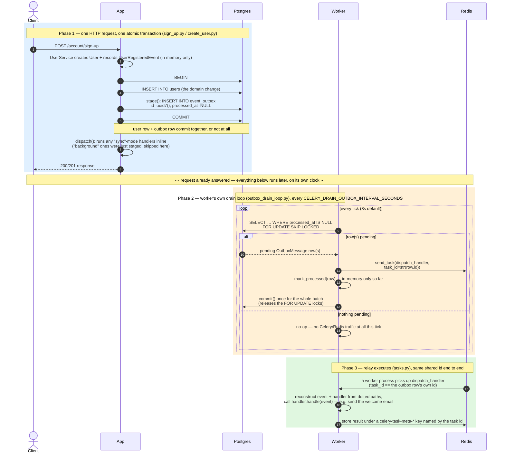

# Transactional Outbox for Background Event Dispatch

> **Implementation Plan v0.9.0**
>
> Closes the one delivery-guarantee gap left open by `docs/plans/3-celery-redis-events.md`: for `"background"`-mode handlers, replaces "publish to Celery right after commit" with "write an outbox row in the *same* database transaction as the domain change, then let the worker process's own drain loop relay it afterward." `"sync"`-mode handlers and the `CELERY_ENABLED=false` inline fallback are both untouched.

---

## What problem this solves, and why it matters here

Skip this section if you already know the transactional outbox pattern by name — it's a well-known distributed-systems pattern, not something invented for this repo. It's included because a plan for a DDD/Clean Architecture/TDD reference project should make the *structural* reason for a pattern legible before its implementation details, not just its mechanics.

### The structural problem: the "dual write" gap

A single use case here does two things that look like one atomic step but aren't: it changes domain state (e.g. "a user registered") *and* it needs to reliably tell the rest of the system that happened (e.g. "send a welcome email"). The state change lives in Postgres. The notification, once Celery is involved, lives in Redis (the broker) and eventually a worker process. Those are two independent systems with no shared transaction between them. Whenever code tries to do both — commit to Postgres, then separately publish to Redis — there is no atomic operation that covers both halves. Something can always fail *between* them:

- Commit succeeds, then the process crashes (or Redis is briefly unreachable) before the publish. Result: the user is registered, but the welcome email is silently never queued. No error, no retry, no trace — the event is just gone.
- The reverse order (publish first, commit second) trades this for the opposite failure: the notification goes out for a domain change that then never actually commits.

This is called the "dual write problem," and it's not specific to Celery, Redis, or this codebase — it shows up anywhere a state change and a notification about that change are written to two different systems with no shared transaction. `docs/plans/3-celery-redis-events.md` actually named this exact gap and set it aside in favor of Celery's own tooling; tracing the real call chain (see `Context` below) confirmed the gap was real, not theoretical.

### The fix: make the notification durable *inside* the same transaction as the state change

The trick is to stop treating "notify" as a second operation against a second system, and instead make it a *write to the same database, in the same transaction* as the state change. Concretely: instead of publishing directly to Celery, the code writes one row to an `event_outbox` table — same Postgres database, same `AsyncSession`, same transaction that's about to commit the domain change. Postgres already guarantees that transaction is all-or-nothing. So "the domain change happened" and "the outbox row recording that a notification is owed exists" become the *same fact*, guaranteed atomic by the database itself, with no second system involved yet.

A second, separate process (this repo's worker) then does the actual delivery: it polls that table for rows nobody has relayed yet, and for each one, publishes to Celery and marks the row processed. This relay step can fail and retry freely — crash mid-relay, and the row is still sitting there marked "not yet processed," so the next poll just tries again. The atomicity that matters (state change + "we owe a notification") already happened; delivery itself only needs to be safe to retry, which is a much easier property to get right than atomicity across two systems ever was.

### Why this is a DDD/Clean-Architecture-shaped fix, not just a Celery workaround

This repo's domain layer already treats "a domain change causes zero or more events" as a first-class concept (`Entity.record_event()`/`collect_events()`) — that's the DDD idea of a domain event: a side effect is something the aggregate *announces*, decoupled from *how* it eventually gets handled. The outbox pattern is what makes that decoupling actually safe once handling that event means crossing a process/system boundary (a Celery worker), rather than just calling a Python function inline. Without it, "decoupled" quietly meant "and also occasionally silently lost." With it, the aggregate's own transaction boundary — the same one Clean Architecture already treats as the unit of consistency for a use case — is also the unit of consistency for "did we durably promise to deliver this event." Nothing about the domain layer changes; the guarantee just now actually holds all the way through delivery, not just up to `commit()`.

### Why this is a TDD-friendly fix, not just a reliability one

Before this pattern, asserting "an event was reliably dispatched" for a background handler meant either mocking Celery entirely (which doesn't prove anything about the delivery gap) or standing up a real broker and worker in a test (slow, and still timing-dependent). After this pattern, the guarantee this plan actually cares about — "the domain change and the promise to notify are atomic" — reduces to a single, fast, deterministic assertion any integration test can make without touching Celery at all: query `event_outbox` in the same test transaction and assert a row exists (see Step 3's tests). The *delivery* half (relay actually reaches a live broker/worker) is still worth a slower real-broker smoke test (Step 6), but it's no longer the only way to prove the guarantee this plan is actually about.

---

## Background: workers, processes/threads, and why Redis is in the picture

Skip this if you're already comfortable with these terms — it exists so the diagram below (and words like "worker process" and "Redis broker" throughout this doc) aren't assumed vocabulary.

**What a "worker" is.** A worker is just a running process whose job is to pull tasks off a queue and execute them — as opposed to a web server process, whose job is to handle incoming HTTP requests. They're the same *kind* of thing (a running program); they just listen to different sources of work. In this repo, the `worker` container runs `celery -A app.main.worker.celery_app:celery_app worker --concurrency=2` — one command that spawns multiple *child OS processes* under a parent (Celery's "prefork" pool). `--concurrency=2` (from `CELERY_WORKER_CONCURRENCY`) means 2 separate child processes, each independently pulling tasks off Redis and running them.

**How this relates to CPU cores.** A CPU core is a physical execution unit that can genuinely run one stream of instructions at a time — more cores means more work can happen *truly simultaneously*, not just interleaved. Celery's own default concurrency is one child process per core, because each child is a separate OS process the operating system can schedule onto a different core at the same instant — real parallelism. `CelerySettings.WORKER_CONCURRENCY`'s own comment explains why this repo overrides that default to a flat `2`: the host is also running Postgres, Redis, and the web app, all competing for the same cores, so matching every core with a worker process would starve everything else. More worker processes than available cores doesn't buy more parallelism — they just take turns.

**Processes vs. threads.** A *process* is an independent running program with its own private memory — two processes can't directly share a Python object; they need something external (a file, a socket, a message broker like Redis) to communicate. A *thread* is a lighter-weight unit of execution *inside* a process; all threads in the same process share that process's memory directly. Python's GIL (Global Interpreter Lock) means only one thread *within a single Python process* can execute Python bytecode at any instant, so Python threads give concurrency (useful for overlapping I/O waits) but not true CPU parallelism — which is exactly why Celery uses separate *processes* (prefork), not threads, to actually use multiple cores. Both concepts show up together in `loop_runtime.py`: each of the 2 worker *processes* additionally runs a background *thread* internally, hosting one persistent asyncio event loop, so a synchronous Celery task body can hand off `async` work without blocking. That thread doesn't add parallelism (still one process, one GIL) — it just lets async code and Celery's synchronous task interface coexist inside that one process.

**Is Redis a database for storing queues?** Functionally, yes — it's more precisely an in-memory key-value store that happens to support queue-like data structures extremely fast, which is why it's a common choice as a message broker. This repo uses it for two distinct roles, in two separate logical databases: the **broker** (`REDIS_DB=0`) — the actual queue `send_task(...)` pushes onto, that every worker child process watches — and the **result backend** (`REDIS_RESULT_DB=1`) — where a finished task's outcome is written as a plain key (`celery-task-meta-<task_id>`) with a TTL, which is what `AsyncResult.get()` is actually polling.

**Why a Celery worker needs Redis at all.** The web process and the worker process are separate OS processes, often in entirely separate containers, with no shared memory. There's no way for the web process to hand a Python object directly to the worker's memory. Both sides need a shared, external channel each can independently connect to over the network — that's what a message broker provides: a durable mailbox one side writes into and the other reads from, regardless of which machine either is actually running on. It's the same "two separate systems with no shared transaction" idea from this doc's very first section — Redis is that second system, and it's precisely the boundary the outbox pattern exists to make safe to cross.

---

## Process flow: what happens when

The single most important thing this diagram needs to convey is that there are **two independent timelines**, not one: the request that writes the outbox row returns to the client *before* anything below the dashed gap has happened. Nothing in Phase 2/3 ever makes the client wait.



**Components, mapped to the actual code:**

| Diagram box | What it really is |
|---|---|
| `App` | The FastAPI web process (`app.main.run`) — `sign_up.py`/`create_user.py` calling `HybridEventDispatcher.stage()`/`dispatch()` |
| `Postgres` | One database, two tables in play: `users` (the domain change) and `event_outbox` (the durable promise to notify) |
| `Worker` | The `worker` container — same process pool runs both `outbox_drain_loop.py`'s perpetual loop *and* `tasks.py`'s `dispatch_handler` task body; Phase 2 and Phase 3 may land on different child processes under it |
| `Redis` | One instance, two logical DBs: `REDIS_DB` (the Celery broker — where `send_task` publishes to) and `REDIS_RESULT_DB` (where a finished task's result is stored) |

The one id threaded through Phase 2 and Phase 3 (`str(row.id)`, generated as a UUID in `SqlaOutboxRepository.add()`) is what makes the `event_outbox` row, the Celery task, and the Redis result key all the same, auditable fact — see Confirmed Decision #3.

---

## Context

A comparative review of four other DDD/Clean Architecture repos implementing Celery-backed event dispatch (`CJHwong/py-clean-architecture-examples`, `mapeveri/python-ddd-cqrs`, `Enforcer/implementing-the-clean-architecture`, `AKHQProduction/delivery_service`) found that two of them independently converged on a transactional outbox: write the event to a DB table in the same transaction as the domain change, then a separate relay drains that table onto the broker.

This directly answers something `celery-redis-events.md`'s own Context section named and then set aside:

> "Celery + Redis was chosen over a Postgres-backed transactional outbox (discussed and set aside) for the industry-standard tooling, retry/monitoring story..."

That framed the outbox and Celery as alternatives. They aren't — they're complementary layers, and tracing the actual current call chain confirms a real gap exists:

```
src/app/outbound/auth_ctx/handlers/sign_up.py:86-97 (identical pattern in
src/app/core/commands/create_user.py:101-112):

    self._user_tx_storage.add(user)
    await self._flusher.flush()                              # DB write, still inside the open transaction
    await self._transaction_manager.commit()                 # <-- transaction COMMITS here
    await self._event_dispatcher.dispatch(user.collect_events())  # <-- events collected + dispatched AFTER commit
```

`src/app/core/common/entities/base.py`'s `record_event()`/`collect_events()` docstrings already document this as deliberate ("Events are collected after the use case commits") — so it's a known, accepted design, not an oversight. But `HybridEventDispatcher` holds no session/transaction reference at all: if the process crashes between `commit()` and `dispatch()`, the domain change is durably persisted and the event is silently lost, with no outbox row to recover it from. This is exactly the "no delivery guarantee" problem `celery-redis-events.md` set out to fix in the first place — solved for the in-process `asyncio.create_task()` case, but not fully closed for the `send_task()` case that replaced it.

**Outcome:** for every `"background"`-mode handler (while `CELERY_ENABLED=true`), the outbox row and the domain change commit atomically, in one transaction. The `worker` process drains unprocessed rows to the broker itself, via its own polling loop — no separate scheduler process. `"sync"`-mode handlers and the Celery-less fallback path are functionally unchanged.

---

## Confirmed decisions

1. **The relay is a plain polling loop the `worker` process starts on itself — not a Celery Beat task, and not a separate `beat` Compose service.** Originally built as a Celery Beat task (`app.events.drain_outbox`, its own `beat` service), then changed after observing the actual running system: a Celery task, even an empty no-op tick, still publishes through the broker and shows up in Flower's live task list and (unless `ignore_result=True`) the Redis result backand on every tick — a heartbeat's worth of noise for every real event, scaling with uptime rather than with actual events. Draining the outbox isn't itself a unit of business work that needs Celery's own tooling (retries, monitoring, routing) — only *relaying an event* is — so it doesn't need to be a Celery task at all. See "Why not a Celery Beat task" below for the full reasoning and how process-safety is preserved without one.
2. **Retention is a setting, not a hardcoded behavior — defaulting to retain, not delete.** Raised directly by the user: the whole point of adding Redis Commander earlier was making an otherwise-invisible mechanism visible, and hard-deleting an outbox row the instant it's relayed would make this one just as invisible again. A `CELERY_OUTBOX_RETAIN_AFTER_RELAY` setting (boolean, default `true`) controls it. The drain loop always relays the row via `send_task` first, then always marks it processed; it only additionally deletes the row when this setting is `false`. Defaulting to retain means a relayed row stays visible in `event_outbox` via Adminer — timestamped, queryable — instead of vanishing on the next tick. The deletion path (`false`) gets its own explicit test rather than being the only behavior ever exercised.
3. **The outbox row's own id is the shared identifier across Postgres, Celery, and Redis — and it's a UUID, not an autoincrement integer.** Raised directly by the user, motivated by auditability: a relayed event should be traceable as *the same event* wherever it shows up — the `event_outbox` row, the Celery task, and its Redis result key. The drain loop passes the outbox row's own `id` as the Celery task's `task_id` (instead of letting Celery generate an unrelated random one), which becomes the Redis result key (`celery-task-meta-<id>`) too. It's a UUID (`uuid7`, the same time-sortable scheme `id_factory.create_user_id()` already uses for `User`) rather than a plain integer specifically because this id now also functions as a cross-system identifier — a plain autoincrement int works as a Celery `task_id` today, but risks an eventual collision with some other id scheme reusing small integers, which a UUID rules out by construction.

---

## Architectural decisions

### Where the atomicity boundary is, and why touching `sign_up.py`/`create_user.py` is unavoidable

Per the additive-building-blocks principle this codebase follows, the strong preference is new files over edits to existing ones. But atomicity is not something that can be bolted on externally — it fundamentally requires the outbox write to happen inside the same DB transaction as the domain change, which means *something* has to move `collect_events()` from after `commit()` to before `flush()`. The traced call chain shows only two call sites follow this exact `add → flush → commit → dispatch` tail (`sign_up.py`, `create_user.py`, both via `UserService.create_user`), so the edit is small, mechanical, and identical in both places — not a redesign of either handler.

### Splitting `HybridEventDispatcher` into `stage()` (pre-commit) and `dispatch()` (post-commit)

`HybridEventDispatcher` gains a new `stage(events: list[DomainEvent]) -> None` method, called **before** `flush()`/`commit()`:

- For each event, for each registered handler where `handler.DISPATCH_MODE == "background"` **and** Celery is enabled: write one `OutboxMessage` row (`event_type`, `handler_type`, `payload` — reusing the existing `event_serialization.dotted_path()` and `DomainEvent.to_payload()` helpers unchanged) via a new `OutboxRepository`, bound to the *same* per-request `AsyncSession` `SqlaFlusher`/`SqlaTransactionManager` already use.
- No-op when Celery is disabled (nothing to stage — the existing inline fallback already runs everything synchronously with no gap to close).

The existing `dispatch(events: list[DomainEvent]) -> None` method (called **after** commit, unchanged call site) narrows its routing:

- `DISPATCH_MODE == "sync"` → run inline, exactly as today.
- `DISPATCH_MODE == "background"` **and Celery disabled** → run inline, exactly as today's fallback.
- `DISPATCH_MODE == "background"` **and Celery enabled** → **skip** — already staged pre-commit by `stage()`, will be relayed by the worker's own drain loop instead of being published directly here.

This means no double-dispatch, and the Celery-less fallback path is byte-for-byte unchanged.

### The relay: a plain per-process polling loop, not a Celery Beat task

A coroutine (`app.main.worker.outbox_drain_loop._run_forever`) that the `worker` process spawns on its own persistent event loop (via `loop_runtime.spawn()`, from the `worker_process_init` signal) and runs for the life of the process: every `CELERY_DRAIN_OUTBOX_INTERVAL_SECONDS`, it queries unprocessed `OutboxMessage` rows (oldest first, capped batch size), calls the *same* `send_task(DISPATCH_HANDLER_TASK_NAME, task_id=..., kwargs=...)` that `HybridEventDispatcher.dispatch()` used to call directly, then marks each row processed (and deletes it too, only if `CELERY_OUTBOX_RETAIN_AFTER_RELAY=false`), committing the whole batch once at the end.

**Why not a Celery Beat task**, which is what this was originally built as: a Beat-scheduled task still goes through the broker and Celery's own task machinery on every tick, whether or not there's anything to drain. That means it shows up in Flower's live task list on every tick regardless (Flower's task view comes from Celery's event stream, independent of the result backend), and — unless the task is marked `ignore_result=True` — also writes a `celery-task-meta-*` key to the Redis result backend on every tick. Over a day of mostly-idle uptime, that's tens of thousands of "SUCCESS: None" entries in both Flower and Redis for a task that did nothing almost every time — noise that scales with uptime, not with actual events, actively working against the "make outbox activity auditable via Redis Commander/Flower" goal Confirmed Decision #2 is about. A plain coroutine loop on the worker's own event loop never touches the broker or result backend for an empty tick, so the only Celery tasks that ever exist are real, one-per-outbox-row `dispatch_handler` tasks — Postgres, Celery/Flower, and Redis all stay a 1:1 mirror of each other.

**Why this needs `SELECT ... FOR UPDATE SKIP LOCKED`, not a plain `SELECT`:** unlike a single Beat process (which published each tick exactly once, so only one worker process ever executed a given drain), a plain polling loop runs inside every worker process — and Celery's prefork pool starts `CELERY_WORKER_CONCURRENCY` separate child processes (2 by default here), each firing its own `worker_process_init` and therefore starting its own independent drain loop. A production deployment might also run several `worker` containers. Without row-level locking, two of these loops polling at the same moment could both see, and both relay, the same still-pending row. `SqlaOutboxRepository.get_pending()` locks every row it returns (`with_for_update(skip_locked=True)`) and skips any row a concurrent call already has locked, so two concurrent batches are always disjoint. That lock has to survive for the whole batch, not just until the first row is marked processed — so `mark_processed()`/`delete()` no longer commit themselves; a new `commit()` method does, called exactly once after the whole batch finishes (see `SqlaOutboxRepository`'s docstrings). Committing per-row would release the lock on that same batch's *own* remaining, not-yet-processed rows immediately, letting a concurrent loop see them as unlocked and pending again — reopening the exact race this exists to close.

### Retaining relayed rows means "row exists" can no longer mean "pending" — a `processed_at` column is required regardless of the retention setting

With Confirmed Decision #2 defaulting to retain, `event_outbox` can hold both pending and already-relayed rows at the same time, so the drain query can't just be "every row in the table" — it needs a nullable `processed_at` timestamp column to distinguish the two: `WHERE processed_at IS NULL` selects only what's actually pending. The drain loop sets `processed_at = now()` on every row it successfully relays, unconditionally, and only *additionally* deletes the row when `CELERY_OUTBOX_RETAIN_AFTER_RELAY=false`. This column exists regardless of the retention setting — it's what makes "retain but don't reprocess" possible at all, not an optional extra.

### The core `OutboxRepository` port stays minimal; the worker's query/mark/delete/commit needs live on the concrete adapter instead

`stage()` (called from the web process, pre-commit) only ever needs to *write* a row, so the `core`-level `OutboxRepository` Protocol stays limited to `add()` — that's the only operation core business logic (by way of `HybridEventDispatcher`) actually depends on. Querying pending rows, marking them processed, deleting them, and committing a batch are pure worker-side housekeeping with no core business-logic meaning, so those become extra methods on the concrete `SqlaOutboxRepository` class itself (`get_pending()`, `mark_processed()`, `delete()`, `commit()`), which `app.main.worker.outbox_drain_loop` imports and calls directly — allowed, since `main` may import `outbound` freely (just not the other way around). This avoids inflating the core port with methods only one worker-side consumer ever calls.

---

## Proposed Changes

### Step 1 — `OutboxMessage` schema, entity, and repository port (Core + Persistence)

**TDD order:** write `tests/unit/outbound/persistence_sqla/test_sqla_outbox_repository.py` and a migration test → RED → create the files below → GREEN.

- **[NEW]** Alembic migration: `event_outbox` table — `id` (PK, UUID, assigned by the repository via `uuid7()`, not a DB-generated default — see Confirmed Decision #3), `event_type` (str, dotted path), `handler_type` (str, dotted path), `payload` (JSON), `created_at` (UTC timestamp), `processed_at` (nullable UTC timestamp — required regardless of the retention setting, since a retained-after-relay row still needs to be distinguishable from a pending one; see Architectural Decisions).
- **[NEW]** `src/app/core/commands/ports/outbox_repository.py` — `OutboxRepository` Protocol: just `add(*, event_type: str, handler_type: str, payload: dict[str, Any]) -> None`, the only operation `stage()` needs. Reading/marking/deleting/committing live on the concrete adapter only (see Architectural Decisions).
- **[NEW]** `src/app/outbound/persistence_sqla/mappings/outbox_message.py` + registry wiring, following the exact pattern of the existing `user`/`auth_session` mappings.
- **[NEW]** `src/app/outbound/adapters/sqla_outbox_repository.py` — `SqlaOutboxRepository`, session-scoped exactly like `SqlaFlusher`/`SqlaTransactionManager`, implementing `OutboxRepository.add()` plus the worker-only `get_pending()` (row-locking, see Architectural Decisions), `mark_processed()`, `delete()`, and `commit()` methods.

### Step 2 — `HybridEventDispatcher.stage()` (Outbound)

**TDD order:** extend `tests/unit/outbound/adapters/test_hybrid_event_dispatcher.py` with `stage()` cases (background handler → one outbox row per handler; sync handler → no row; Celery disabled → no row) → RED → modify `hybrid_event_dispatcher.py` → GREEN.

- `HybridEventDispatcher` gains an `OutboxRepository` constructor dependency and the `stage()` method described above.
- `dispatch()`'s background branch gains the "skip if Celery enabled" condition described above.

### Step 3 — Rewire `SignUp`/`CreateUser` (Outbound auth_ctx / Core commands)

**TDD order:** extend `tests/integration/with_infra/account/test_sign_up.py` and `tests/integration/with_infra/users/test_create_user.py` with a case asserting an outbox row exists (via a test-only repository read) immediately after signup, even before any relay runs → RED → modify both handlers' tails → GREEN.

```python
self._user_tx_storage.add(user)
await self._event_dispatcher.stage(user.collect_events())   # NEW -- pre-commit
await self._flusher.flush()
await self._transaction_manager.commit()
await self._event_dispatcher.dispatch(user.collect_events())  # unchanged call, now only runs sync/fallback handlers
```

Note `collect_events()` is called twice (it's called-and-cleared once by `stage()`); the second call on the same entity returns an empty list. This is why `stage()` is written to accept the already-collected list from the caller rather than the entity itself — consistent with the existing `dispatch()` signature.

### Step 4 — Worker-side relay: the outbox drain loop (Main/worker)

**TDD order:** write `tests/unit/main/worker/test_drain_outbox.py` (fakes for the repository and `celery_app`; a case with retention on asserting `mark_processed()` is called, `delete()` is not, and `commit()` is called exactly once for the batch; a case with retention off asserting `mark_processed()`/`delete()`/one `commit()`) and `tests/unit/main/worker/test_outbox_drain_loop.py` (the perpetual-loop wrapper: a failed tick is logged and swallowed, the loop keeps ticking afterward, and it sleeps the configured interval between ticks) → RED → create the files below → GREEN.

- **[NEW]** `src/app/main/worker/outbox_drain_loop.py` — `start()`/`stop()` (spawn/cancel the loop on the worker's persistent event loop, called from `celery_app.py`'s `worker_process_init`/`worker_process_shutdown`), `_run_forever()` (the perpetual tick loop), and `_drain_outbox()` (per-tick body: relay each pending row via `send_task(..., task_id=str(message.id_))`, then `mark_processed()`/`delete()`, then one `commit()` for the whole batch).
- **[NEW]** `src/app/main/worker/loop_runtime.py` gains `spawn()` — schedules a coroutine on the persistent loop without blocking the caller, unlike the existing `run_coroutine()`; used for a loop meant to run for the life of the process rather than one call a caller needs the result of.
- **`CelerySettings`** (`src/app/main/config/settings.py`/`loader.py`) gains `OUTBOX_RETAIN_AFTER_RELAY: bool = True` (env `CELERY_OUTBOX_RETAIN_AFTER_RELAY`) and `DRAIN_OUTBOX_INTERVAL_SECONDS: float = 3.0` (env `CELERY_DRAIN_OUTBOX_INTERVAL_SECONDS`), following the exact pattern already used for `ENABLED`/`WORKER_CONCURRENCY`.

### Step 5 — Infra: no separate service needed

No new Compose service, and no new `docker-entrypoint.sh` case — the existing `worker` command starts the drain loop itself (via `celery_app.py`'s `worker_process_init` hook), so there's nothing extra to bring up or configure at the infra level.

### Step 6 — Tests

**Unit:** `SqlaOutboxRepository` CRUD, including that `get_pending()` locks its rows and `commit()` is what releases them; `HybridEventDispatcher.stage()` routing (background/sync/disabled); `_drain_outbox` with a faked repository + faked `celery_app.send_task` (including the shared `task_id` and single-commit-per-batch assertions); `_run_forever`'s resilience (a failed tick doesn't kill the loop) and interval handling.

**Integration (eager mode):** signup/create-user flows assert an outbox row is created transactionally (present even if the request fails after staging but before an unrelated later failure — i.e. staged-and-rolled-back-together, not staged-and-orphaned); a rollback test asserting that if `flush()` raises (e.g. duplicate username), the staged outbox row is rolled back too, since it's part of the same transaction.

**Real-broker smoke test:** extend `tests/smoke/test_celery_broker.py` (or a new sibling) to assert an outbox row placed directly in the test DB gets drained and its task shows `SUCCESS` within a timeout, against the real `worker`+`redis` containers, and that the task's id in Flower/Redis matches the outbox row's own id.

---

## File Summary

| Action | File | Layer |
|---|---|---|
| NEW (migration) | `alembic/versions/<rev>_add_event_outbox.py` | persistence |
| NEW | `src/app/core/commands/ports/outbox_repository.py` | core |
| NEW | `src/app/outbound/persistence_sqla/mappings/outbox_message.py` | outbound |
| NEW | `src/app/outbound/adapters/sqla_outbox_repository.py` | outbound |
| MODIFY | `src/app/outbound/adapters/hybrid_event_dispatcher.py` | outbound |
| MODIFY | `src/app/outbound/auth_ctx/handlers/sign_up.py` | outbound |
| MODIFY | `src/app/core/commands/create_user.py` | core |
| NEW | `src/app/main/worker/outbox_drain_loop.py` | main |
| MODIFY | `src/app/main/worker/loop_runtime.py`, `src/app/main/worker/celery_app.py` | main |
| MODIFY | `observability/promtail/promtail-config.yml` (scope log discovery to this Compose project) | infra |
| NEW/MODIFY | unit tests for the above, 2 integration test extensions, 1 smoke test extension | tests |

## Verification Plan

**Automated:**
```bash
make test
make test-docker
uv run lint-imports
uv run mypy
```

**Manual:**
1. `make upd` — brings up `worker`/`redis`/`flower` (no separate `beat` container).
2. `docker compose logs -f worker` — confirm it starts and logs nothing extra on an idle tick (the drain loop produces no output when there's nothing pending).
3. Temporarily `docker compose stop worker`, sign up a user, confirm a row now exists in `event_outbox` via Adminer with `processed_at` still `NULL`.
4. `docker compose start worker` — confirm `processed_at` gets set within the drain interval, the row **stays** in the table (default `CELERY_OUTBOX_RETAIN_AFTER_RELAY=true`), the email still arrives, and Flower/Redis show exactly one `dispatch_handler` task whose id matches the outbox row's own `id` — no `drain_outbox`-style entry appears at all.
5. Set `CELERY_OUTBOX_RETAIN_AFTER_RELAY=false` in `.secrets`, `make down && make upd`, repeat steps 3-4, and confirm the row is deleted instead of marked.
6. `make check` — full lint/type/import/test pass.
