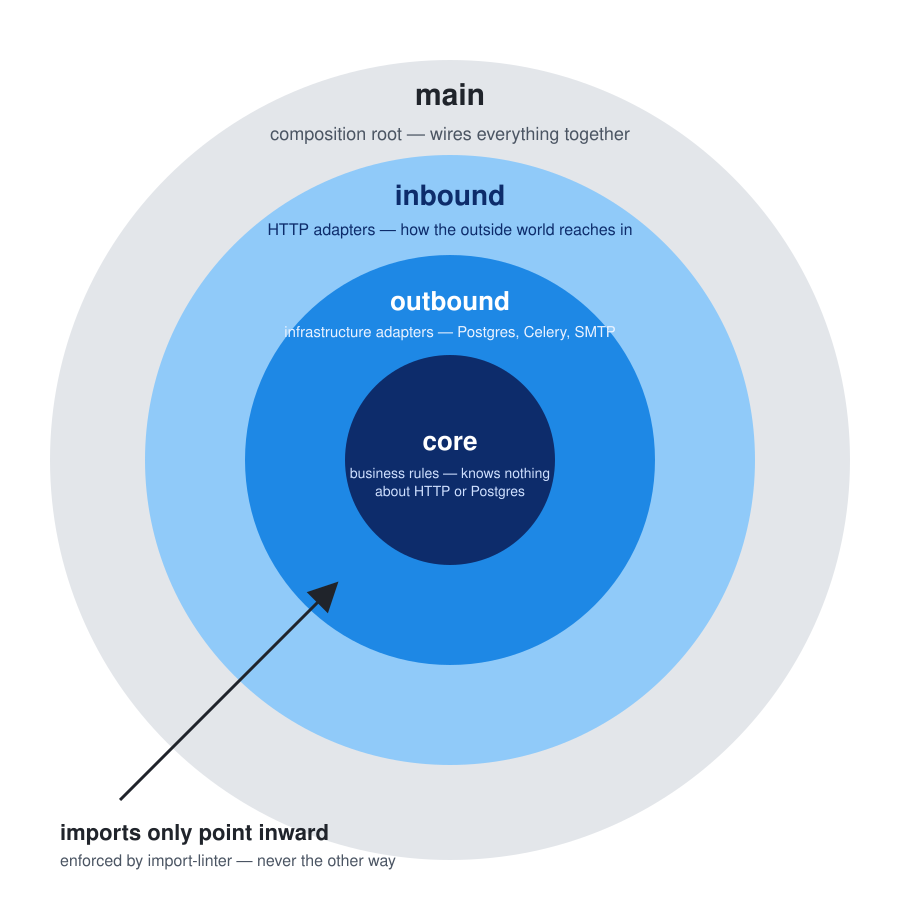

# Layer Dependencies & Import Rules

!!! sourcefiles "Relevant Source Files/Folders"
    - [`pyproject.toml`](../../../../pyproject.toml) — the `[tool.importlinter]` section (real, enforced contracts)
    - [`src/app/core/`](../../../../src/app/core/) — business rules (innermost layer)
    - [`src/app/outbound/`](../../../../src/app/outbound/) — infrastructure adapters
    - [`src/app/inbound/`](../../../../src/app/inbound/) — HTTP adapters
    - [`src/app/main/`](../../../../src/app/main/) — composition root (outermost layer)
    - [`src/app/inbound/http/health/checks.py`](../../../../src/app/inbound/http/health/checks.py) — a concrete example of what the linter does *not* catch

    > These links resolve when this page is opened as a raw `.md` file in an IDE like VS Code (cmd/ctrl-click follows them straight to the file) — they 404 in the browser here, since the rendered site doesn't serve the source tree itself. That's expected, not a bug.

## What "Clean Architecture" and "Domain-Driven Design" actually are

**Clean Architecture** ([Robert C. Martin's original formulation](https://blog.cleancoder.com/uncle-bob/2012/08/13/the-clean-architecture.html)) is a way of arranging code into concentric layers so business logic sits at the center, and everything that can change for reasons unrelated to the business itself — which web framework, which database, which message broker — sits at the edges. Its one non-negotiable rule, the **Dependency Rule**, is exactly what the rest of this page is about: source code dependencies may only point inward, toward business logic, never outward toward a framework or a driver. The payoff is that business logic never has to change just because the database or the web framework did.

**Domain-Driven Design** ([Eric Evans' term](https://martinfowler.com/bliki/DomainDrivenDesign.html)) is a complementary discipline for what goes *inside* that innermost layer: modeling code around the real business domain and its own vocabulary, using a small, deliberate set of building blocks — **Entities** (things with identity that persists over time, like `User`), **Value Objects** (things defined purely by their value, like `Email` or `Username`), and **Domain Events** (things that happened, like `UserRegisteredEvent`). Clean Architecture says *where* business logic lives and what it can't depend on; DDD says *how* to shape that business logic once it's there. This codebase uses both together — [Core Layer (Domain & Business Rules)](core-layer.md) is where the DDD building blocks actually live.

This project's four rings (`main`/`inbound`/`outbound`/`core`) are a concrete, codebase-specific naming of the same idea Martin's original diagram draws more generically (Entities → Use Cases → Interface Adapters → Frameworks & Drivers): `core` corresponds to Entities-plus-Use-Cases, `inbound`/`outbound` together are Interface Adapters, and `main` is Frameworks & Drivers plus the composition root that wires them all together. The rest of this page is the one concrete, enforced rule that makes that separation real rather than aspirational.

## The one rule

An import can only point from an outer layer toward an inner one, never back. `core` — the innermost layer — never knows it's running behind HTTP (HyperText Transfer Protocol), or that its data lives in Postgres.

!!! figure "Layer boundaries and import direction"
    

    > The four rings, outer to inner, are `main`, `inbound`, `outbound`, `core`. An import can only cross a ring boundary going inward (toward `core`); it can never cross going outward. This isn't a convention enforced by code review or a linter left to bit-rot — it's a real, passing/failing check that runs in `make check` (`lint-imports`, backed by [`import-linter`](https://github.com/seddonym/import-linter)), reading the `[[tool.importlinter.contracts]]` blocks in [`pyproject.toml`](../../../../pyproject.toml).

The first, load-bearing contract, declared in [`pyproject.toml`](../../../../pyproject.toml), is a `layers` contract:

```toml
[[tool.importlinter.contracts]]
id = "clean-architecture"
name = "inner must not import outer"
type = "layers"
containers = ["app"]
layers = [
  "(main)",
  "inbound",
  "outbound",
  "core",
]
```

Read top to bottom, each layer may import anything **listed after it**, never anything listed before it. Concretely: `main` may import `inbound`, `outbound`, or `core`; `inbound` may import `outbound` or `core` (but never `main`); `outbound` may import `core` only; `core` may import nothing from any of the other three. The parentheses around `(main)` mark it as an "independent" layer in import-linter's own terms — nothing else in the graph is required to import it (as the composition root, nothing does), so its absence from some import path is never itself a violation.

!!! figure "What each layer is allowed to import (skip-level imports included)"
    ```mermaid
    %%{init: {"theme": "default", "themeVariables": {"fontSize": "14px"}, "flowchart": {"nodeSpacing": 20, "rankSpacing": 16, "padding": 10, "subGraphTitleMargin": {"top": 5, "bottom": 12}, "useMaxWidth": false}}}%%
    flowchart LR
        subgraph main_layer["main"]
            main_desc(["composition root"])
        end
        subgraph inbound_layer["inbound"]
            inbound_desc(["HTTP adapters"])
        end
        subgraph outbound_layer["outbound"]
            outbound_desc(["infra adapters"])
        end
        subgraph core_layer["core"]
            core_desc(["business rules"])
        end

        main_layer --> inbound_layer
        inbound_layer --> outbound_layer
        outbound_layer --> core_layer
        main_layer -.-> outbound_layer
        main_layer -.-> core_layer
        inbound_layer -.-> core_layer

        linkStyle default stroke-width:3px,stroke:#333333
        style main_layer stroke-width:1px,stroke:#333333
        style inbound_layer stroke-width:1px,stroke:#333333
        style outbound_layer stroke-width:1px,stroke:#333333
        style core_layer stroke-width:1px,stroke:#333333
    ```

    > Solid arrows are the adjacent-layer imports that make up most of the codebase's wiring (e.g. `inbound` calling into `outbound`'s use-case handlers); dashed arrows are the same rule applied to a skip-level import (e.g. `main`'s composition root wiring a `core` port straight to an `outbound` adapter, or `inbound` importing an exception type declared in `core.common`). Both are equally legal under the `layers` contract — what's illegal is any arrow running the other direction.

## The real import graph, generated from the code itself

The diagram above is hand-drawn, for a clean, minimal illustration of the rule. The one below isn't — it's generated by [`scripts/wiki/dependency_graph.py`](../../../../scripts/wiki/dependency_graph.py) directly from `grimp.build_graph("app")` (the same import-walking library `import-linter` itself uses) every time this wiki builds, so it can never silently drift from what the code actually does the way a hand-drawn diagram eventually could.



## What each layer actually is, in plain language

- **`core`** — business rules that don't know how they're triggered or where data lives. It defines *what* the application does (create a user, list users, authorize a role change) purely in terms of its own types and **ports** — abstract interfaces it needs but doesn't implement. See [Core Layer (Domain & Business Rules)](core-layer.md).
- **`outbound`** — the concrete "how do we talk to the outside world" adapters: Postgres via SQLAlchemy, SMTP (Simple Mail Transfer Protocol), bcrypt, Celery. Each one implements a port `core` declared. See [Outbound Layer (Infrastructure Adapters)](outbound-layer.md).
- **`inbound`** — the concrete "how does the outside world reach us" adapters: FastAPI routers, request/response models, the error-mapping middleware. See [Inbound Layer (HTTP / Presentation)](inbound-layer.md).
- **`main`** — the composition root: the one place that knows every concrete class that exists, and wires a concrete `outbound` adapter into whatever `core` asked for via a port. See [Main (Composition Root)](main-composition-root.md).

## Why: Dependency Inversion / Ports-and-Adapters

`core` doesn't import `outbound` — it can't, the linter forbids it. Instead, `core` declares a **port**: an abstract contract stating "I need something that can `get_user_by_id`, or `hash` a password, or `commit` a transaction." Look at [`src/app/core/commands/ports/transaction_manager.py`](../../../../src/app/core/commands/ports/transaction_manager.py) — a plain `Protocol` with one abstract method, no SQLAlchemy import in sight. `outbound`'s [`SqlaTransactionManager`](../../../../src/app/outbound/adapters/sqla_transaction_manager.py) then *implements* that same shape, wrapping a real `AsyncSession`. Nothing in `core` ever imports `SqlaTransactionManager` — the composition root (`main`) is the only place that imports both the port and the concrete adapter, and hands the adapter to `core`'s use case through dependency injection (see [`src/app/main/ioc/core.py`](../../../../src/app/main/ioc/core.py)'s `provide(SqlaTransactionManager, provides=TransactionManager)` line).

!!! figure "A real dependency being injected: CreateUser's full constructor, wired by CoreProvider"
    ```mermaid
    %%{init: {"theme": "default", "themeVariables": {"fontSize": "14px"}, "flowchart": {"nodeSpacing": 30, "rankSpacing": 90, "padding": 20, "subGraphTitleMargin": {"top": 5, "bottom": 12}, "useMaxWidth": false}}}%%
    flowchart LR
        router["inbound/http/users/create_user.py<br/>handler: FromDishka[CreateUser]"]

        subgraph bindings["main/ioc/core.py — CoreProvider"]
            b_cus["provide(CurrentUserService)"]
            b_us["provide(UserService)"]
            b_ut["provide(SystemUtcTimer,<br/>provides=UtcTimer)"]
            b_uts["provide(SqlaUserTxStorage,<br/>provides=UserTxStorage)"]
            b_fl["provide(SqlaFlusher,<br/>provides=Flusher)"]
            b_tm["provide(SqlaTransactionManager,<br/>provides=TransactionManager)"]
            b_ed["provide(HybridEventDispatcher,<br/>provides=EventDispatcher)"]
        end

        subgraph ctor["core/commands/create_user.py — CreateUser.__init__"]
            c_cus["current_user_service: CurrentUserService"]
            c_us["user_service: UserService"]
            c_ut["utc_timer: UtcTimer"]
            c_uts["user_tx_storage: UserTxStorage"]
            c_fl["flusher: Flusher"]
            c_tm["transaction_manager: TransactionManager"]
            c_ed["event_dispatcher: EventDispatcher"]
        end

        b_cus --> c_cus
        b_us --> c_us
        b_ut --> c_ut
        b_uts --> c_uts
        b_fl --> c_fl
        b_tm --> c_tm
        b_ed --> c_ed
        ctor --> router

        linkStyle default stroke-width:3px,stroke:#333333
        style bindings stroke-width:1px,stroke:#333333
        style ctor stroke-width:1px,stroke:#333333
    ```

    > [`CreateUser`](../../../../src/app/core/commands/create_user.py) is a real, unsimplified `core.commands` class — it declares seven constructor dependencies purely by type: two plain concrete services (`CurrentUserService`, `UserService`) and five ports. [`CoreProvider`](../../../../src/app/main/ioc/core.py) is the only place in the codebase that knows the concrete adapter behind each port — `provide(SqlaTransactionManager, provides=TransactionManager)` tells Dishka "when something asks for a `TransactionManager`, hand it a `SqlaTransactionManager`," and so on for each of the other four. At request time, the router's `handler: FromDishka[CreateUser]` parameter asks Dishka for a fully-constructed `CreateUser`; Dishka resolves all seven dependencies recursively from `CoreProvider`'s bindings and calls `CreateUser.__init__` with the results, before a single line of `CreateUser.execute()` runs. `CreateUser` itself never imports Dishka, `SqlaTransactionManager`, or any other concrete adapter — everything it received arrived by type alone. See [Core Patterns → Dependency Injection with Dishka](../core-patterns/dependency-injection.md) for how `CoreProvider`'s bindings themselves are structured.

This buys three concrete things, all real in this codebase today:

1. **Swap infrastructure without touching business rules.** `EmailSettings.USE_CONSOLE` switches between `ConsoleEmailSender` and `SmtpEmailSender` (see [`src/app/main/ioc/core.py`](../../../../src/app/main/ioc/core.py)'s `provide_email_sender`) — every use case that sends email keeps calling the same `EmailSender` port, unaware which one is behind it.
2. **Add a second way in.** Nothing about `core.commands.create_user.CreateUser` assumes HTTP. A future CLI (Command-Line Interface) or gRPC entrypoint could call the exact same class — it would live in its own package alongside `inbound`, not inside it.
3. **Unit-test business rules with zero database or web server.** Every port can be faked in a unit test; the real Postgres/SQLAlchemy stack is only exercised by integration tests.

## The CQRS split and the auth-ctx boundary

Four more `forbidden`-type contracts, also declared in [`pyproject.toml`](../../../../pyproject.toml), sit alongside the `layers` contract, each policing a narrower, additive rule inside a single layer:

```toml
[[tool.importlinter.contracts]]
id = "cqrs-common-must-not-import-commands"
source_modules = ["app.core.common"]
forbidden_modules = ["app.core.commands"]

[[tool.importlinter.contracts]]
id = "cqrs-common-must-not-import-queries"
source_modules = ["app.core.common"]
forbidden_modules = ["app.core.queries"]

[[tool.importlinter.contracts]]
id = "cqrs-commands-must-not-import-queries"
source_modules = ["app.core.commands"]
forbidden_modules = ["app.core.queries"]

[[tool.importlinter.contracts]]
id = "cqrs-queries-must-not-import-commands"
source_modules = ["app.core.queries"]
forbidden_modules = ["app.core.commands"]

[[tool.importlinter.contracts]]
id = "auth-ctx"
name = "auth-ctx must use its own adapters"
source_modules = ["app.outbound.auth_ctx"]
forbidden_modules = ["app.outbound.adapters"]
```

!!! figure "Forbidden-import contracts inside core and outbound"
    ```mermaid
    %%{init: {"theme": "default", "themeVariables": {"fontSize": "14px"}, "flowchart": {"nodeSpacing": 20, "rankSpacing": 16, "padding": 10, "subGraphTitleMargin": {"top": 5, "bottom": 12}, "useMaxWidth": false}}}%%
    flowchart LR
        subgraph core_common["core.common"]
            common_desc(["entities, VOs, ports, events"])
        end
        subgraph core_commands["core.commands"]
            commands_desc(["writes"])
        end
        subgraph core_queries["core.queries"]
            queries_desc(["reads"])
        end
        subgraph outbound_auth["outbound.auth_ctx"]
            auth_desc(["session/JWT adapters"])
        end
        subgraph outbound_adapters["outbound.adapters"]
            adapters_desc(["port implementations"])
        end

        core_commands -->|allowed| core_common
        core_queries -->|allowed| core_common
        core_commands -. forbidden .-> core_queries
        core_queries -. forbidden .-> core_commands
        core_common -. forbidden .-> core_commands
        core_common -. forbidden .-> core_queries
        outbound_auth -. forbidden .-> outbound_adapters

        linkStyle default stroke-width:3px,stroke:#333333
        linkStyle 2 stroke:#c0392b,stroke-width:3px
        linkStyle 3 stroke:#c0392b,stroke-width:3px
        linkStyle 4 stroke:#c0392b,stroke-width:3px
        linkStyle 5 stroke:#c0392b,stroke-width:3px
        linkStyle 6 stroke:#c0392b,stroke-width:3px
        style core_common stroke-width:1px,stroke:#333333
        style core_commands stroke-width:1px,stroke:#333333
        style core_queries stroke-width:1px,stroke:#333333
        style outbound_auth stroke-width:1px,stroke:#333333
        style outbound_adapters stroke-width:1px,stroke:#333333
    ```

    > Black arrows are allowed (both `core.commands` and `core.queries` may freely import shared building blocks from `core.common` — entities, value objects, ports, exceptions); red arrows are contract violations `lint-imports` would fail the build on. Two independent rules are shown:
    >
    > - **CQRS (Command Query Responsibility Segregation) separation** — `core.commands` (writes: `CreateUser`, `GrantAdmin`, …) and `core.queries` (reads: `ListUsers`) may each depend on `core.common`, but never on each other, and `core.common` itself may never reach "up" into either. This keeps the read side and write side of the domain from becoming secretly coupled through a leaked import — a query model changing shape can never accidentally break a command, and vice versa.
    > - **`auth_ctx` is a second, independent adapter tree** — `outbound.auth_ctx` (session/JWT (JSON Web Token) plumbing behind login/logout) may never import `outbound.adapters` (the port implementations `core` depends on). See [Outbound Layer (Infrastructure Adapters)](outbound-layer.md) for why two separate adapter trees exist at all and what each duplicates.

## What the linter does *not* catch

`import-linter`'s contracts only police imports **between the four named top-level packages** (`app.main`, `app.inbound`, `app.outbound`, `app.core`) and, for the `forbidden` contracts, between specific sub-packages inside `core`/`outbound`. It says nothing about which *third-party* libraries any given layer reaches for directly.

A real example already living in this codebase: [`src/app/inbound/http/health/router.py`](../../../../src/app/inbound/http/health/router.py) injects a plain `sqlalchemy.ext.asyncio.AsyncSession` straight from Dishka (`session: FromDishka[AsyncSession]`) and hands it to [`src/app/inbound/http/health/checks.py`](../../../../src/app/inbound/http/health/checks.py)'s `db_check`:

```python
from sqlalchemy import text
from sqlalchemy.ext.asyncio import AsyncSession


async def db_check(session: AsyncSession) -> None:
    try:
        await session.scalar(text("SELECT 1"))
    except Exception as e:
        raise ProbeError from e
```

This is `inbound` importing `sqlalchemy` directly — no `core` port in sight, no `outbound` adapter in between. `lint-imports` passes on this without complaint, because `sqlalchemy` isn't part of the `app` package the contracts are scoped to (`containers = ["app"]`); the contract simply has no opinion on it. In practice this is a deliberate, low-stakes shortcut for a liveness/readiness probe that only ever runs `SELECT 1` and has no business logic to protect — but it's a genuine, real gap between "the rule as stated" (imports only ever point inward, through ports) and "the rule as enforced" (imports between four specific packages only). Anywhere a stricter guarantee mattered, this same gap could just as easily hide a `core` layer file reaching for `requests` or `boto3` directly — the linter would stay green throughout.

## Where to go next

- [Core Layer (Domain & Business Rules)](core-layer.md) — what lives inside the innermost ring, and how the CQRS split shown above is actually structured.
- [Outbound Layer (Infrastructure Adapters)](outbound-layer.md) — the two adapter trees the `auth-ctx` contract above keeps separate.
- [Main (Composition Root)](main-composition-root.md) — where ports and adapters actually get wired together.
